class:middle

# Workshop Presentation, May 2023

Robert Winslow

2023-05-12

---

## Today:

1. Some descriptive comparisons of Partial Unemployment Insurance Between states.
2. *Unemployment insurance and the role of self-insurance*, by Abdulkadiroğlu, Kuruşçu, Şahin, 2002

---

layout: true
class: header

## Unemployment insurance in (Sahin et al 2002)

---

### Structure of Unemployment Insurance

$$\theta(t) = 
\begin{cases}
    \theta_t & \text{if } t\in\{0,...,T-1\} \\
    \theta_T & \text{if } t\geq T
\end{cases}$$

- Each $\theta$ is a replacement ratio, meaning that a person collecting unemployment insurance receives a fraction of their typical income.
- $t$ is the duration of the person's current unemployment spell. (optimal benefits will taper off)
- For tractability the replacement ratio is constant from period $T$ of unemployment onwards.

---

### Consumer's choices

The consumer's optimand is straightforward:

$$E \sum_j \beta^j U(c_j,l_j) $$

Two decisions the consumer faces:

1. How to split income between consumption and (non-interest-bearing) savings
    - budget is $m'+c = m+y_d$, where $m$ is assets, and $y_d$ is disposable income.

2. Whether to work (when the worker has a job offer)
    - The worker can either choose not not to work, in which case $l=1$
    - or they can choose to work a fixed amount $\hat h (=0.45)$, in which case $l=1-\hat h$
    - Beyond this possible binary decision each period, they can't choose *how much* to work.
 

---

### Model of Job Search

Three more state variables are introduced: $s,\eta,\mu$.

- Employment opportunity $s\in\set{e,u}$ represents whether the person has a job opportunity ($s=e$) or not ($s=u$).
    - $s$ evolves according to a 2x2 transition matrix $\chi$, calibrated like so:

$$\chi = 
\begin{bmatrix}
   \chi(e,e) & \chi(e,u) \\
   \chi(u,e) & \chi(u,u)
\end{bmatrix} =
\begin{bmatrix}
   0.9681 & 0.0319 \\
   0.5 & 0.5
\end{bmatrix}
$$

- employment status $\eta\in\Set{0,1}$ represents whether the person is actually working. 
- $\mu\in\set{0,1}$ indicates whether the person collects unemployment benefits.
    - If $(s,\eta)=(e,0)$, there is a probability $\pi(t)$ that the person collects benefits and probability $1-\pi(t)$ they do not.
    - Otherwise, $\mu$ works as you'd expect. 
        - $(s,\eta)=(e,1) \implies \mu=0$, 
        - and $(s,\eta)=(u,0) \implies \mu=0$

<!--
- Note that $s=u \implies \eta=0$. But if the person chooses not to accept an employment opportunity, $(s,\eta)=(e,0)$.
-->

---

### Value Function and State?

---

### Summary of Results

---

---

layout: false

## State UI Recipients Over Time

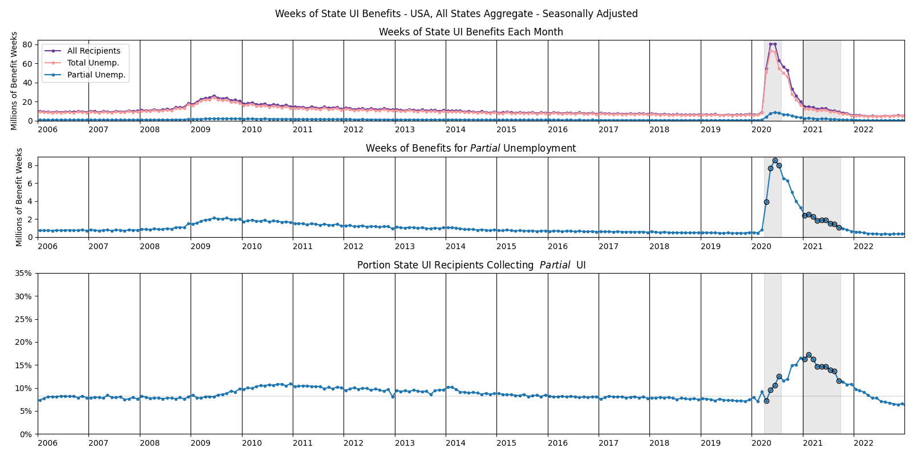

---

## How is time use determined.

- Benefits depend both on the current week's gross earnings, 
(denoted $w$ in the following slides),
and on the individual's "Weekly Benefit Amount" (WBA).
- Your WBA is the amount you collect when totally unemployed.
    - Except for high earners, it's about half of your typical income.
    - Constant throughout entire UI spell.

---

## State UI in CA

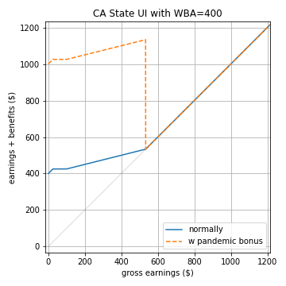

Benefits schedule:
- Roughly speaking, benefits $b  =WBA - \frac{3}{4}w$
- Benefits cut off when $w > \frac{4}{3}w$. 
- (There's also a few extra caveats for those with very low income.)

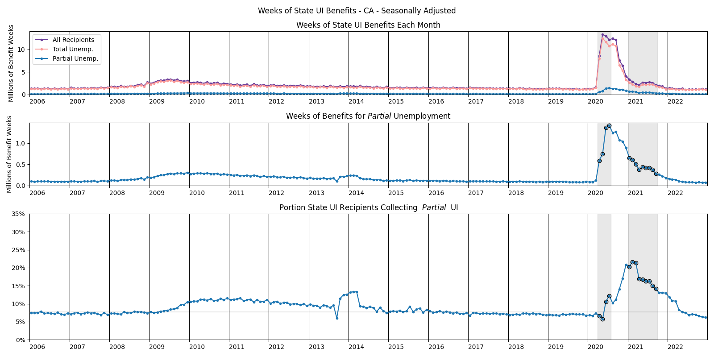

---

## State UI in NY

During the pandemic, the rule was that to receive benefits:

- you must be working reduced hours
- this week's gross earnings must be no more than 504 dollars
- you must work no more than three days this week
    - each day worked reduces benefits by 25%

As of August 2021, the rule is the same, save that "days worked" 
are now defined in terms of hours worked.

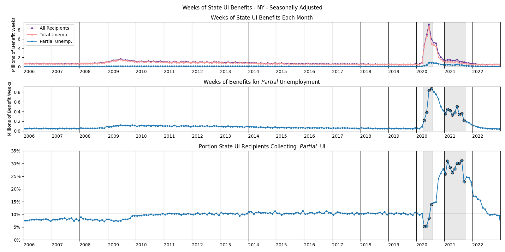

---

## State UI in TX

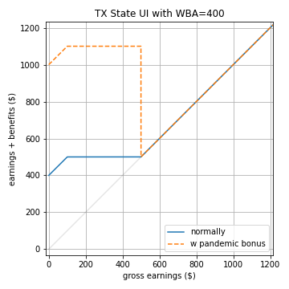

In Texas, the rule is 
- that $b = WBA$ if $w < \frac{WBA}{4}$,
- and $b = \frac{5}{4}WBA - w$ if $\frac{WBA}{4} \leq w \leq \frac{5}{4}WBA$.
- Benefits cut off when $w > \frac{5}{4}WBA$.

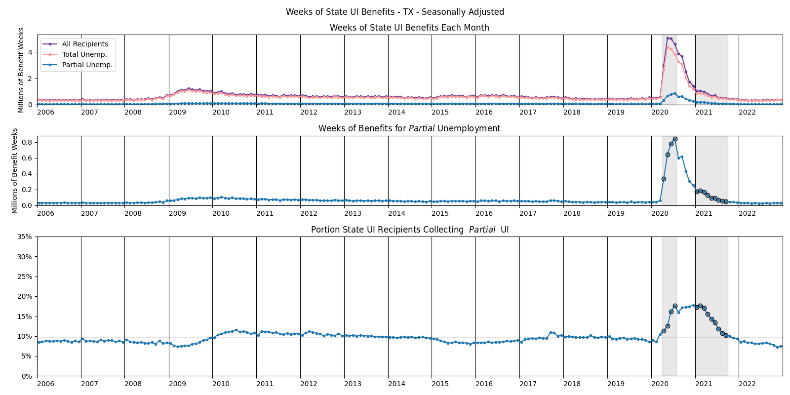

---

## State UI in PA

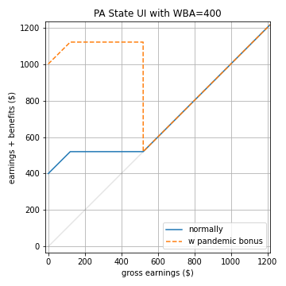

In Pennsylvania, the rule is 
- that $b = WBA$ if $w < 0.3\times WBA$,
- and $b = 1.3 \times WBA - w$ if $0.3\times WBA \leq w \leq 1.3 \times WBA$.
- Benefits cut off when $w > 1.3 \times WBA$.

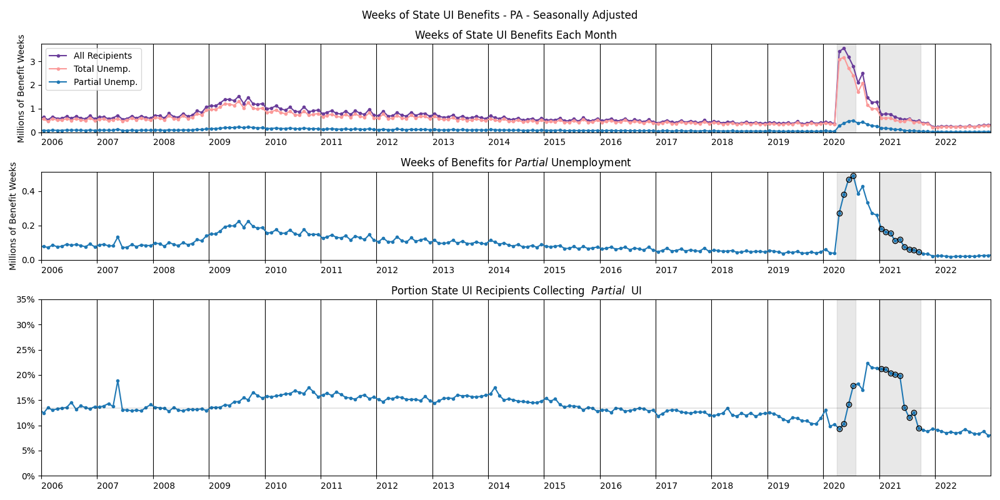

---

## State UI in IL

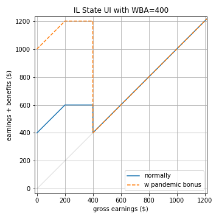

In Illinois, the rule is
- that $b = WBA$ if $w < \frac{WBA}{2}$,
- and $b = \frac{3}{2}WBA - w$ if $\frac{WBA}{2} \leq w < WBA$.
- Benefits cut off when $w \geq WBA$. This means there's a cliff.

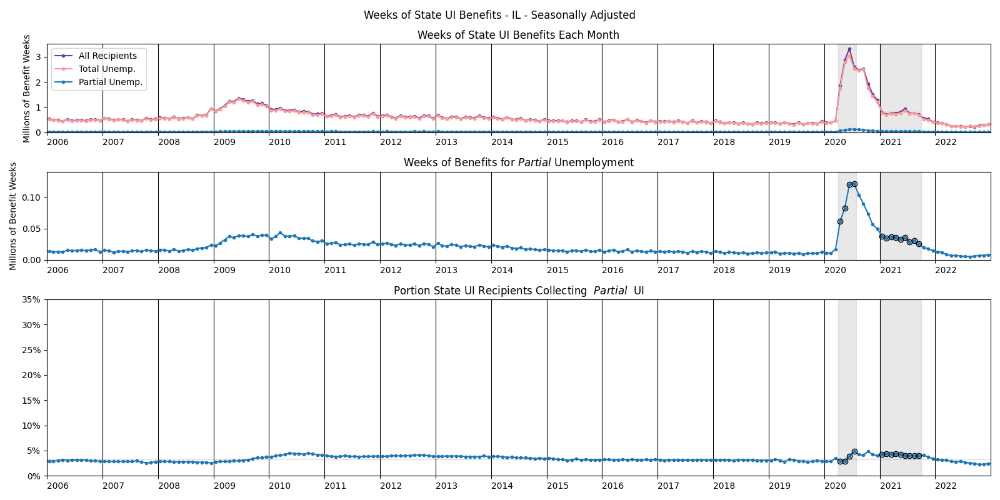

---

## State UI in FL

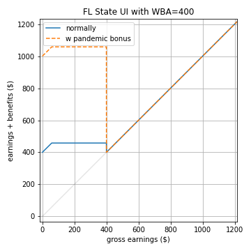

In Florida, the rule is
- that $b = WBA$ if $w < 58$,
- and $b = 58 + WBA - w$ if $58 \leq w < WBA$.
- Benefits cut off when $w \geq WBA$. This means there's a cliff.

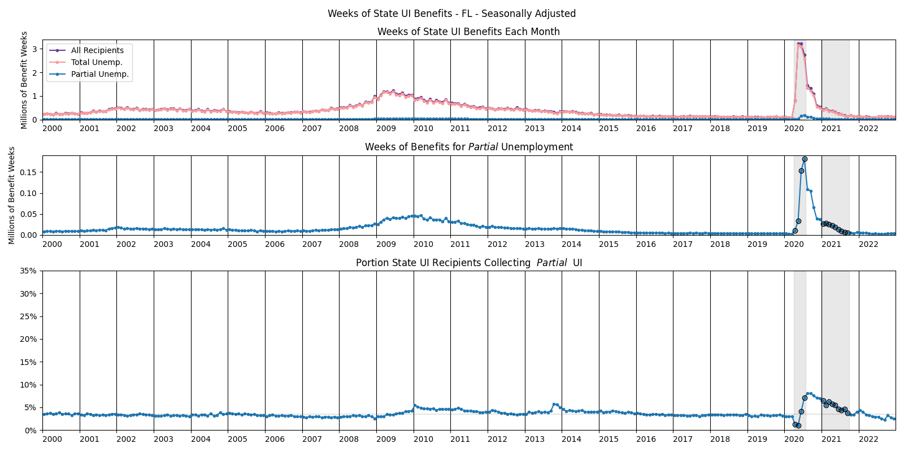

---

## State UI in MN

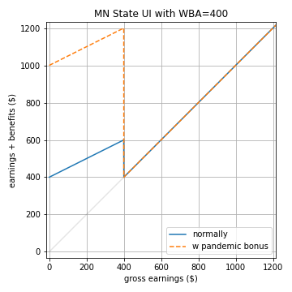

In Minnesota, the rule is $b = WBA - \frac{w}{2}$ if $w < WBA$.  
Benefits cut off when $w \geq WBA$.

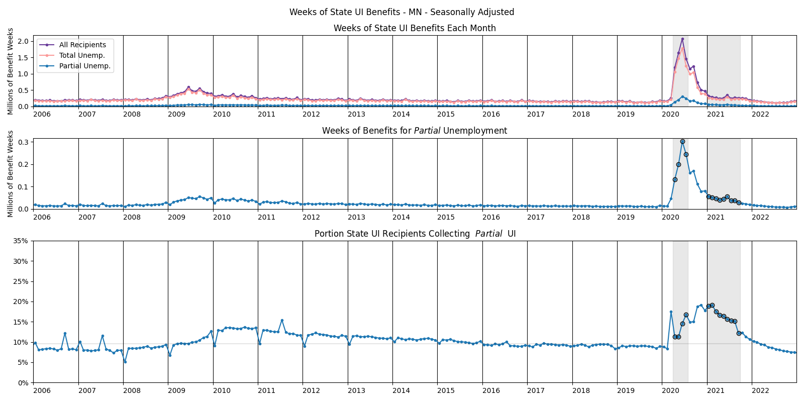

---

# Time Use by Gender

## Amount

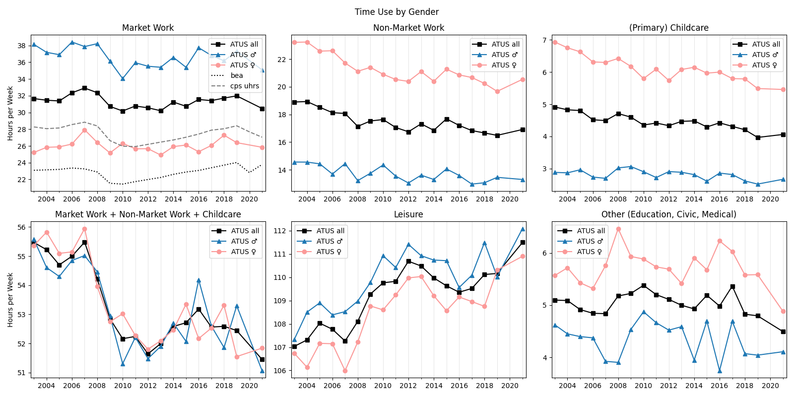

---

# Time Use by Gender

## Change since 2003

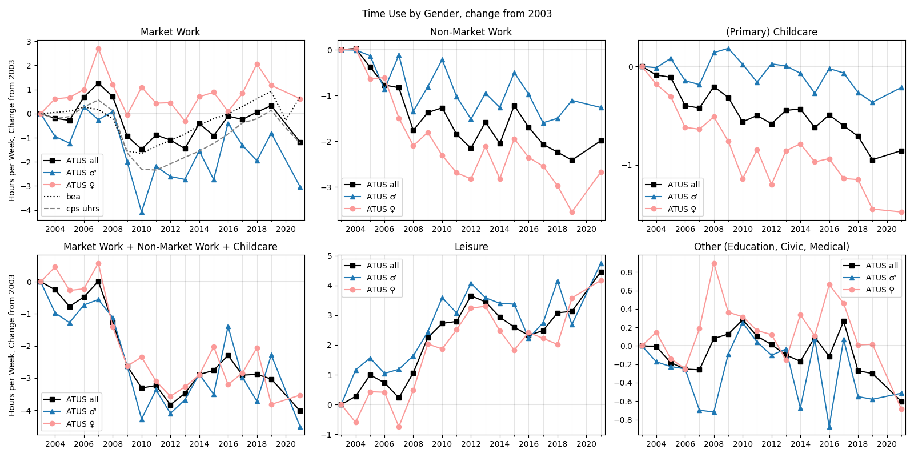

---

# Time Use by Gender

## index 2003=100

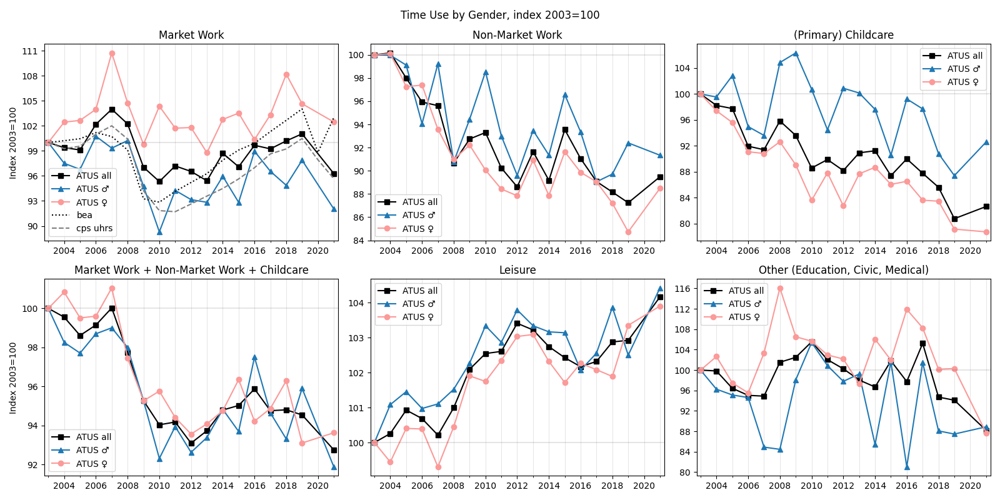

---

# Time Use by Gender

## indexed on average from 2014-2019

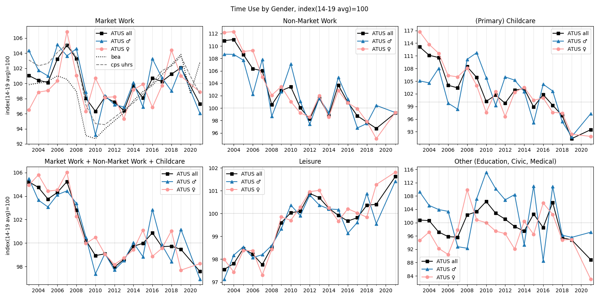

---

