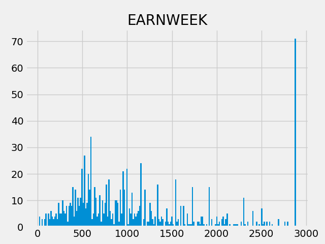
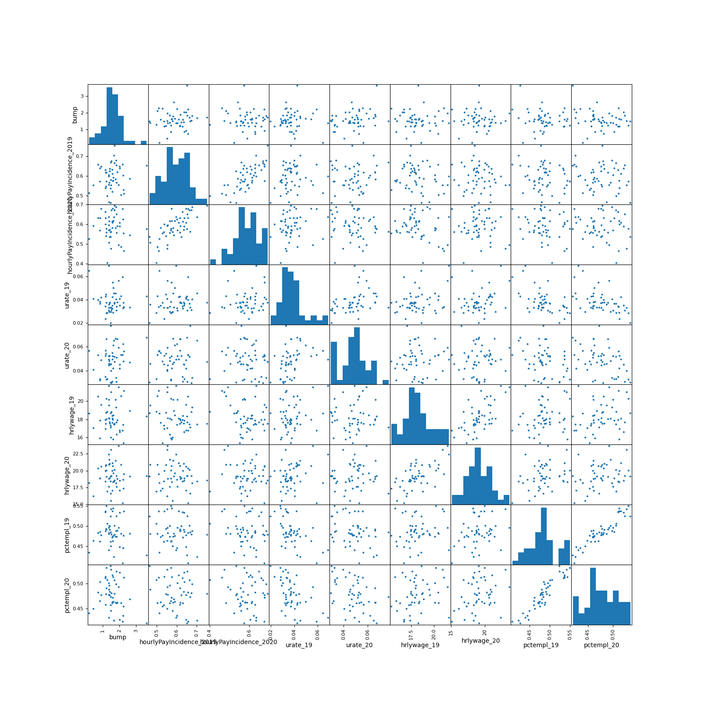

class:middle


# Office Hours: May 26

Robert Winslow

2023-05-26


---

<!--
## Today:

1. Summary of Papers read
2. Bunching Data
-->


---

<!--
layout: true
class: header

<h2 style="background-color: #9cd6e4;">Bunching</h2>
layout: false
-->

---


- **Do taxpayers bunch at kink points?** (Saez 2010)
    - Uses IRS *Individual Public Use Tax Files* from 1960-2004
    - Most important part of paper is just eyeballing a KDE.
- [IRS Individual Public-Use Microdata Files](https://www.irs.gov/statistics/soi-tax-stats-individual-public-use-microdata-files)
    - Website says years 2012-2015 are available.
    - Access must be purchased. 

--

- Would self-report data work for this purpose? Not really:




---

- **US unemployment insurance replacement rates during the pandemic** (Ganong, Noel, Vavra 2020)
    - Combines data from 
        - 2019 Annual Social and Economic Supplement (ASEC) of the CPS
        - Info on distribution of unemployment from monthly CPS in 2020.


---

### Size of Partial UI Bump by state.


Ratio of portion partial UI during normal times to portion partial UI during program window.

- "Normal Times": 2012-2019
- "Program Window": April 2020 to September 2021
- "Portion Partial UI": Percentage of UI recipients collecting less than total benefits 


---

### Correlations with bump size




---

### Correlations with bump size

```
pctempl_20                -0.205053
pctempl_19                -0.126870
hourlyPayIncidence_2020   -0.047807
urate_19                  -0.038662
hrlywage_19               -0.024553
hrlywage_20               -0.024497
cartodb_id                -0.023912
bees                       0.000398
hourlyPayIncidence_2019    0.144863
urate_20                   0.267438
bump                       1.000000
```

---

### Probability Hourly Worker by State (2019)


---

### Probability Hourly Worker by State (2020)


---


