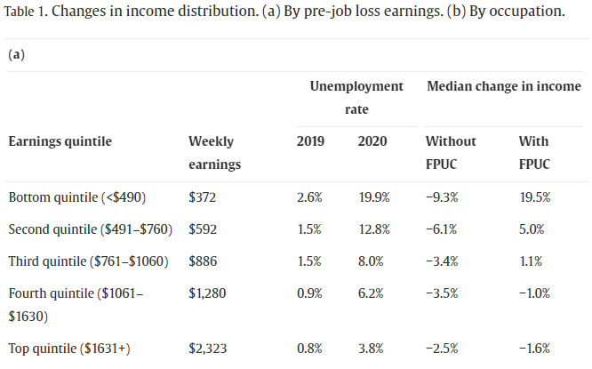

class:middle

# Office Hours: July 28, 2023

Robert Winslow

What is the effect of partial unemployment insurance on labor decisions?

$$
\gdef\etaE{\text{E}}
\gdef\etaP{\text{P}}
\gdef\etaU{\text{U}}
\gdef\sE{e}
\gdef\sP{p}
\gdef\sU{u}
\gdef\hP{\hat{h}_p}
\gdef\hE{\hat{h}_e}
$$

---

## Model

- Simple model of job search and unemployment insurance.
- Based on:
    - *The role of unemployment insurance in an economy with liquidity constraints and moral hazard* (Hansen, Imrohoroğlu, 1992)
    - *Unemployment insurance and the role of self-insurance.* (Abdulkadiroğlu, Kuruşçu, Şahin, 2002).
- My contribution is the addition of *partial* unemployment insurance.

---

### Consumer's choices

The consumer's optimand is straightforward:

$$\mathbb{E} \sum_j \beta^t U(c_t,l_t) = \mathbb{E} \sum_t \beta^t \frac{(c_t^{1-\sigma}l_t^\sigma)^{1-\rho}-1}{1-\rho}$$

Two decisions the consumer faces:

1. How to split income between consumption and (non-interest-bearing) savings
    - budget is $m'+c = m+y_d$, where $m$ is assets, and $y_d$ is disposable income.
    - assets are subject to the constraint $m'\geq 0$

2. Whether and how much to work when give a job opportunity. (See next slide.)

<!--These basics are very similar to (Abdulkadiroğlu, Kuruşçu, Şahin, (2002)).-->

---

### Job Search

- Employment opportunity $s\in\set{e,p,u}$ represents whether the person has a job opportunity ($s=e$), a partial job opportunity ($s=p$) or no job opportunity ($s=u$). (Employment, Partial employment, full Unemployment)
    - $s$ evolves according to a 3x3 transition matrix $\chi$, <!--TODO: Calibrate-->

$$\chi = 
\begin{bmatrix}
   \chi(e,e) & \chi(e,p) & \chi(e,u) \\
   \chi(p,e) & \chi(p,p) & \chi(p,u) \\
   \chi(u,e) & \chi(u,p) & \chi(u,u) 
\end{bmatrix}
$$

- employment status $\eta\in\Set{\etaE,\etaP,\etaU}$ represents the level of work the consumer actually chooses to engage in. 
    - If $s=\sE$, consumer can choose from $\eta\in\Set{\etaE,\etaP,\etaU}$
    - If $s=\sP$, consumer can choose from $\eta\in\Set{\etaP,\etaU}$
    - If $s=\sU$, consumer must choose $\eta = \etaU$

<!--
- Note that $s=u \implies \eta=0$. But if the person chooses not to accept an employment opportunity, $(s,\eta)=(e,0)$.
-->

---

### Unemployment Benefits

$\mu\in\set{0,1}$ is a binary variable indicating whether the person collects unemployment benefits.

- If $s=\sE$, then $\mu=0$
- If $(s,\eta)=(\sP,\etaP)$ or $(\sU,\etaU)$, then $\mu=1$
- If $\eta=\etaU$, but $s\neq\sU$, then $\mu=1$ with probability $\pi_u$, 0 otherwise
- If $\eta=\etaP$, but $s\neq\sP$, then $\mu=1$ with probability $\pi_p$, 0 otherwise

If Consumer collects benefits, the benefits adjust their disposable income to some fraction of employed disposable income, called the "replacement rate".

-  $\theta_p$ is replacement rate for partially employed (when $(\eta,\mu)=(\etaP,1)$)
-  $\theta_u$ is replacement rate for unemployed (when $(\eta,\mu)=(\etaU,1)$)

<!--TODO?: Make pi dependent on s, eta, and previous s or eta?-->

---

### Utility Flows, Income, and Leisure

Given $(m,m',\eta,\mu)$, utility flow is:

$$U\Big(m-m'+y_d(\eta,\mu),\;l(\eta)\Big)$$

where

$$
y_d(\eta,\mu) =
\begin{cases}
   (1-\tau)y                &\text{if } (\eta,\mu)=(\etaE,0) \\
   (1-\tau)yθ_p             &\text{if } (\eta,\mu)=(\etaP,1) \\
   (1-\tau)yθ_u             &\text{if } (\eta,\mu)=(\etaU,1) \\
   (1-\tau)y\frac{\hP}{\hE} &\text{if } (\eta,\mu)=(\etaP,0) \\
   0                        &\text{if } (\eta,\mu)=(\etaU,0) \\
\end{cases}
$$

and

$$
l(\eta) =
\begin{cases}
   1-\hE &\text{if } \eta=\etaE \\
   1-\hP &\text{if } \eta=\etaP \\
   1 &\text{if } \eta=\etaU \\
\end{cases}
$$

---

### Timeline Within Each Period

1. Consumer recieves potential job offer $s\in\set{e,p,u}$
2. Consumer chooses employment status $\eta\in\Set{\etaE,\etaP,\etaU}$
3. Draw $\mu\in\set{0,1}$: does Consumer get unemployment benefits?   
4. Consumer chooses $m'$ after seeing $\mu$

---

### Value Functions

$$
V(e,m) = \max_{\eta\in\set{\etaE,\etaP,\etaU}}\Big\lbrace
\mathbb{E} \left[\max_{m'}\Set{U(m-m'+y_d(\eta,\mu),l(\eta))+cont(e,m')}\right]
\Big\rbrace
$$

$$
V(p,m) = \max_{\eta\in\set{\etaP,\etaU}}\Big\lbrace
\mathbb{E} \left[\max_{m'}\Set{U(m-m'+y_d(\eta,\mu),l(\eta))+cont(p,m')}\right]
\Big\rbrace
$$

$$
V(u,m) = \max_{m'}\Set{U(m-m'+y_d(\eta,\mu),l(\eta))+cont(u,m')}
$$

where

$$cont(s,m') \equiv \beta \sum_{s'}\chi(s,s')V(m',s')$$

---

### Market Clearing and Equilibrium

State of a person is $x=(m,s,\eta,\mu)$

Stationary equilibrium consists of 
- decision rules $\eta(m,s)$, $c(x)$, $m'(x)$
- time-invariant measure $\lambda(x)$ of people in state $x$
- tax rate $\tau$

Such that

- Given $\tau$, the decision rules are optimal for the consumers.
- Goods market clears: 

$$\sum_x \lambda(x) c(x) = \sum_x \lambda(x) \cdot 
\begin{cases}
y                &\text{if }\eta=\etaE\\
\frac{\hP}{\hE}y &\text{if }\eta=\etaP\\
0                &\text{if }\eta=\etaU\\
\end{cases}
$$

- $\lambda(x')=\lambda(x)$
- Government budget  balanced (?):

---

layout: true

<!--## Calibration
### Transition Probabilities-->

### Real world data for χ:

Looking at CPS longitudinal data 2012-2019:

- 6% of the labor force is unemployed.
- 94% of the labor force is employed.
    - 69% of the labor force is working full time.
    - 22% of the labor force is working part time.
        - 4% of labor force is working pt for economic reasons.
        - 18% is working part-time for non-economic reasons.
    - 3% of labor force is employed but not at work.

---

---

<!--
layout: false

### Real world data for χ:

Part time workers. Notice the difference between economic reasons, and non-economic reasons.

-->

---

layout: true

### Real world data for χ:

Looking at CPS longitudinal data 2012-2019:

- 6% of the labor force is **unemployed**. (**U**)
- 94% of the labor force is employed.
    - 69% of the labor force is **working full time**. (**E**)
    - 22% of the labor force is working part time.
        - 4% of labor force is **working pt for economic reasons.** (**P**)
        - 18% is working part-time for non-economic reasons.
    - 3% of labor force is employed but not at work.

---

---

Among the subset of these three groups, "E", "U", and "P" make up 89%, 5%, and 6% respectively.

---

Looking at CPS longitudinal data 2012-2019, 
and only looking at periods where a person transitions between two of these states,
the transition probabilities would be:

$$\chi = 
\begin{bmatrix}
   \chi(e,e) & \chi(e,p) & \chi(e,u) \\
   \chi(p,e) & \chi(p,p) & \chi(p,u) \\
   \chi(u,e) & \chi(u,p) & \chi(u,u) 
\end{bmatrix}
=
\begin{bmatrix}
   0.96 & 0.02 & 0.02 \\
   0.57 & 0.33 & 0.10 \\
   0.47 & 0.12 & 0.41 
\end{bmatrix}
$$

Which has stationary distribution $[0.93, 0.03, 0.04]$,

But I didn't just use this directly. Among other reasons, the length of a period in the data is one year, whereas in the model a period is six weeks.

---

layout: false

### Calibrating χ

I set

$$\chi = 
\begin{bmatrix}
   \chi(e,e) & \chi(e,p) & \chi(e,u) \\
   \chi(p,e) & \chi(p,p) & \chi(p,u) \\
   \chi(u,e) & \chi(u,p) & \chi(u,u) 
\end{bmatrix}
=
\begin{bmatrix}
   0.94 & 0.03 & 0.03 \\
   0.57 & 0.33 & 0.10 \\
   0.40 & 0.10 & 0.50 
\end{bmatrix}
$$

Which has stationary distribution $[0.89, 0.05, 0.06]$.

<!--It's also is qualitatively similar to the measured transitions while having the desired stationary distribution, and preserving the fact that χuu=0.5.-->

<!--
0.0462 unemployed, seeking full-time work
0.0095 unemployed, seeking part-time work

0.0217 not at work, usually full-time
0.0107 not at work, usually part-time

0.0016 full-time hours, usually part-time for economic reasons
0.6816 full-time hours (35+), usually full-time
0.0049 full-time hours, usually part-time for non-economic reasons
0.6881

0.0519 part-time for non-economic reasons, usually full-time
0.1322 part-time hours, usually part-time for non-economic reasons
0.1841
0.0298 part-time hours, usually part-time for economic reasons
0.01 part-time for economic reasons, usually full-time
0.0398
0.2239
-->

---

### Calibrating working time

- $\hE$ is set to $0.45$, representing a full work week of 45 hours out of possible 100.

- And time spent for part-time work is set to $\hP=0.225$.
    - Half of $\hE$
    - Matches CPS data for actual hours worked last week.

<!--- $\hE=0.45$ (time Spent for full time work.)-->

---

### Other parameters:

These use the same values as (Hansen, Imrohoroğlu, 1992) and (Şahin et al, 2002):

- $\beta=0.995$ (time discount factor)
- $\rho=2.5$ (risk aversion)
- $y=1$ (output from full time work normalized to 1)

However, the value of $\sigma=0.67$ from those papers 
led to partial employment being preferred to full, 
even in the absence of unemployment insurance.
As such, I set:
- $\sigma=0.6$ (parameter in utility)

---

layout: true

### Optimal Policies in some simple cases

---

No Savings, no partial UI ($\theta_p=\frac{\hP}{\hE}$), full enforcement ($\pi_p=\pi_u=0$)

| Optimal $\theta_u$ | Tax Rate | Employment Rate | Average Utility |
|:------------------:|:--------:|:---------------:|:---------------:|
| 70% | 4.6% | 89%+5% | -0.4940 |

(Same result with full enforcement.)

<!--
|  |  |  |  |
-->

---

No Savings, no partial UI ($\theta_p=\frac{\hP}{\hE}$), no enforcement ($\pi_p=\pi_u=1$)

| Optimal $\theta_u$ | Tax Rate | Employment Rate | Average Utility |
|:------------------:|:--------:|:---------------:|:---------------:|
| 70% | 4.6% | 89%+5% | -0.4940 |

---

With Savings, no partial UI ($\theta_p=\frac{\hP}{\hE}$), full enforcement ($\pi_p=\pi_u=0$)

| Optimal $\theta_u$ | Tax Rate | Employment Rate | Average Utility |
|:------------------:|:--------:|:---------------:|:---------------:|
| 80% | 5.2% | 89%+5% | -0.4899 |

<!--
|  |  |  |  |
-->

---

With Savings, no partial UI ($\theta_p=\frac{\hP}{\hE}$), no enforcement ($\pi_p=\pi_u=1$)

| Optimal $\theta_u$ | Tax Rate | Employment Rate | Average Utility |
|:------------------:|:--------:|:---------------:|:---------------:|
| 20% | 1.4% | 89%+5% | -0.4925 |

----

---

layout: false

## New Material for July 28th

- Results with $\sigma=0.5$
- A couple small answers about data from the IPUMS CPS
    - meaning of unemployed "for economic reasons"
    - average hours worked by category of worker
- model with heterogeneity

---

layout: true

### Optimal Policy with σ = 0.5

---

No Savings, no partial UI ($\theta_p=\frac{\hP}{\hE}$), ($\pi_p=\pi_u=1$)

| Optimal $\theta_u$ | Tax Rate | Employment Rate | Average Utility |
|:------------------:|:--------:|:---------------:|:---------------:|
| 0.75 | 0.049 | 89%+5% (full) | -0.4193 |

<!--Same with or without enforcement-->

---

Savings, no partial UI ($\theta_p=\frac{\hP}{\hE}$), full enforcement ($\pi_p=\pi_u=0$)
 
| Optimal $\theta_u$ | Tax Rate | Employment Rate | Average Utility |
|:------------------:|:--------:|:---------------:|:---------------:|
| 0.85 | 0.056 | 89%+5% (full) | -0.4124 |

---

No Savings, no partial UI ($\theta_p=\frac{\hP}{\hE}$), no enforcement ($\pi_p=\pi_u=1$)

| Optimal $\theta_u$ | Tax Rate | Employment Rate | Average Utility |
|:------------------:|:--------:|:---------------:|:---------------:|
| 0.30 | 0.021 | 89%+5% (full) | -0.4153 |

---

layout: true

### Optimal Policy with σ = 0.66

---

No Savings, no partial UI ($\theta_p=\frac{\hP}{\hE}$), ($\pi_p=\pi_u=1$)

| Optimal $\theta_u$ | Tax Rate | Employment Rate | Average Utility |
|:------------------:|:--------:|:---------------:|:---------------:|
| 0.5 | 0.043 | 89%+5% (full) | -0.5422 |

<!--Same with or without enforcement-->

---

Savings, no partial UI ($\theta_p=\frac{\hP}{\hE}$), full enforcement ($\pi_p=\pi_u=0$)
 
| Optimal $\theta_u$ | Tax Rate | Employment Rate | Average Utility |
|:------------------:|:--------:|:---------------:|:---------------:|
| 0.5 | 0.0429 | 47%+46% | -0.5337 |

---

No Savings, no partial UI ($\theta_p=\frac{\hP}{\hE}$), no enforcement ($\pi_p=\pi_u=1$)

| Optimal $\theta_u$ | Tax Rate | Employment Rate | Average Utility |
|:------------------:|:--------:|:---------------:|:---------------:|
| 0.15 | 0.0127 | 53%+40% | -0.5348 |

---

layout: false

<!--
Why does optimal θu go down when savings is enabled?---
-->
<!--Is it standard to have a lower bound for utility instead of using - float inf?-->

### Exact Details of "economic reasons"

What does it mean to work part-time for "economic reasons" in the IPUMS CPS data?

IPUMS provides more details for the reasons for working part time.

Among those working part-time for economic reasons: 

- 61% are doing so because of "slack work, business conditions"
- 34% because they "could only find part-time" work.
- 4% because of "seasonal work"
- and 1% just mechanically because the "job started/ended during week" of the data collection.

(The most common "non-economic" reasons for working part time are family/personal obligations, school/training, having a "full time work week under 35 hours", and taking a vacation/personal day.)

---

### Details of average hours actually worked.

On average, how many hours did people actually work last week?
(In IPUMS CPS ASEC 2012-2019)

- For those working full time, the average was 44 hours (though "usual" hours worked was 41)
- For those working part-time for economic reasons, 23 hours.
- For those working part-time for non-economic reasons, 21 hours.

---

## MODEL WITH HETEROGENEITY

<!--
- slide with details of distribution from ganong2020us
- how do I calibrate χ?
- slide describing scaling factor?
- some sort of results
-->

---

### Data on UI income distribution:

In *US unemployment insurance replacement rates during the pandemic* (Ganong, Noel, and Vavra, 2020), 
the authors use CPS data to estimate the income distribution of 
workers benefitting from the Pandemic Unemployment Compensation.

Table 1 from (Ganong, Noel, and Vavra, 2020)

---

### Adding heterogeneity to model.

- 5 'types' of people corresponding to income quintiles from (Ganong, Noel, and Vavra, 2020)
- Each type still has $y$ normalized to 1.
- But each type also has a scaling factor representing how many dollars that $y=1$ represents.
- When calculating market-clearing, aggregates, etc, those scaling factors are used.
- (This setup means that two full-time workers with different productivity levels will have the 'same' utility. Should I instead explicitly give each type a different value for $y$?)

---

### Simple Little Experiment with this version of the model.

According to (Ganong, Noel, and Vavra, 2020):

> The size of the payment—$600—was designed to replace 100% of the mean U.S. wage when combined with mean state UI benefits. 

Consider the following policies:
- (A) A 50% replacement rate for both partial and fully unemployed.
- (B) A 100% replacement rate, with the same tax rate as in (A)
- (C) A 50% replacement rate + 600 dollar bonus, with the same tax rate as in (A)
- (D) As (B), but with a tax rate which balances budget.
- (E) As (C), but with a tax rate which balances budget.

---

### Simple Little Experiment with this version of the model.

|  | $\theta_u=\theta_p=$ | bonus | $\tau$ | deficit | mean $U$ |
|:-:|:-:|:-:|:-:|:-:|:-:|
| A | 0.5 | 0   | 0.0334 |  0    | -0.4134 |
| B | 1.0 | 0   | 0.0334 | 59.17 | -0.3656 |
| C | 0.5 | 600 | 0.0334 |  5.60 | -0.3881 |
| D | 1.0 | 0   | 0.0877 |  0    | -0.4113 |
| E | 0.5 | 600 | 0.0928 |  0    | -0.3925 |

(But this is too incomplete to be very interesting.
I'm not imposing an unemployment shock, and there is perfect enforcement.
As a result, there is full employment in each case,
so this just captures the welfare gains of redistribution.)

