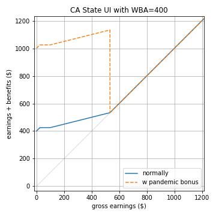
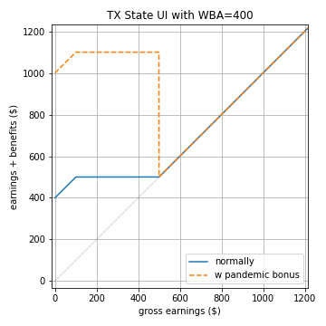
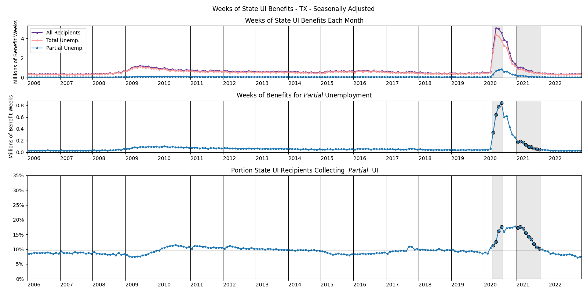
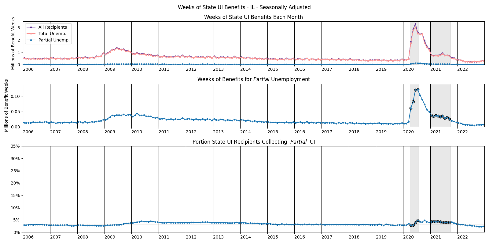

# Office Hours 2023-05-05

---

## State UI Recipients Over Time

---

## How is time use determined.

- Benefits depend both on the current week's gross earnings, 
(denoted $w$ in the following slides),
and on the individual's "Weekly Benefit Amount" (WBA).
- Your WBA is the amount you collect when totally unemployed.
    - Except for high earners, it's about half of your typical income.
    - Constant throughout entire UI spell.

---

## State UI in CA

Benefits schedule:
- Roughly speaking, benefits $b  =WBA - \frac{3}{4}w$
- Benefits cut off when $w > \frac{4}{3}w$. 
- (There's also a few extra caveats for those with very low income.)

---

## State UI in NY

During the pandemic, the rule was that to receive benefits:

- you must be working reduced hours
- this week's gross earnings must be no more than 504 dollars
- you must work no more than three days this week
    - each day worked reduces benefits by 25%

As of August 2021, the rule is the same, save that "days worked" 
are now defined in terms of hours worked.

---

## State UI in TX

In Texas, the rule is 
- that $b = WBA$ if $w < \frac{WBA}{4}$,
- and $b = \frac{5}{4}WBA - w$ if $\frac{WBA}{4} \leq w \leq \frac{5}{4}WBA$.
- Benefits cut off when $w > \frac{5}{4}WBA$.

---

## State UI in PA

In Pennsylvania, the rule is 
- that $b = WBA$ if $w < 0.3\times WBA$,
- and $b = 1.3 \times WBA - w$ if $0.3\times WBA \leq w \leq 1.3 \times WBA$.
- Benefits cut off when $w > 1.3 \times WBA$.

---

## State UI in IL

In Illinois, the rule is
- that $b = WBA$ if $w < \frac{WBA}{2}$,
- and $b = \frac{3}{2}WBA - w$ if $\frac{WBA}{2} \leq w < WBA$.
- Benefits cut off when $w \geq WBA$. This means there's a cliff.

---

## State UI in FL

In Florida, the rule is
- that $b = WBA$ if $w < 58$,
- and $b = 58 + WBA - w$ if $58 \leq w < WBA$.
- Benefits cut off when $w \geq WBA$. This means there's a cliff.

---

## State UI in MN

In Minnesota, the rule is $b = WBA - \frac{w}{2}$ if $w < WBA$.  
Benefits cut off when $w \geq WBA$.

---

# Time Use by Gender

## Amount

---

# Time Use by Gender

## Change since 2003

---

# Time Use by Gender

## index 2003=100

---

# Time Use by Gender

## indexed on average from 2014-2019

---

