class:middle

# Workshop Presentation, May 2023

Robert Winslow

2023-05-12

---

## Today:

1. Some descriptive comparisons of Partial Unemployment Insurance Between states.
2. *Unemployment insurance and the role of self-insurance*, by Abdulkadiroğlu, Kuruşçu, Şahin, 2002

---

layout: true
class: header

<h2 style="background-color: #9cd6e4;">Unemployment Insurance in Different States</h2>

---

### State UI Recipients Over Time

---

### How is time use determined.

- Benefits depend both on the current week's gross earnings, 
(denoted $w$ in the following slides),
and on the individual's "Weekly Benefit Amount" (WBA).
- Your WBA is the amount you collect when totally unemployed.
    - Except for high earners, it's about half of your typical income.
    - Constant throughout entire UI spell.

---

### State UI in CA

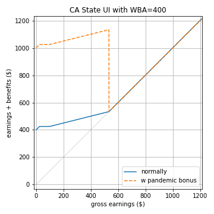

Benefits schedule:
- Roughly speaking, benefits $b  =WBA - \frac{3}{4}w$
- Benefits cut off when $w > \frac{4}{3}w$. 
- (There's also a few extra caveats for those with very low income.)

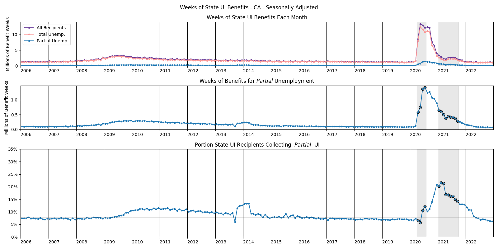

---

### State UI in NY

During the pandemic, the rule was that to receive benefits:

- you must be working reduced hours
- this week's gross earnings must be no more than 504 dollars
- you must work no more than three days this week
    - each day worked reduces benefits by 25%

As of August 2021, the rule is the same, save that "days worked" 
are now defined in terms of hours worked.

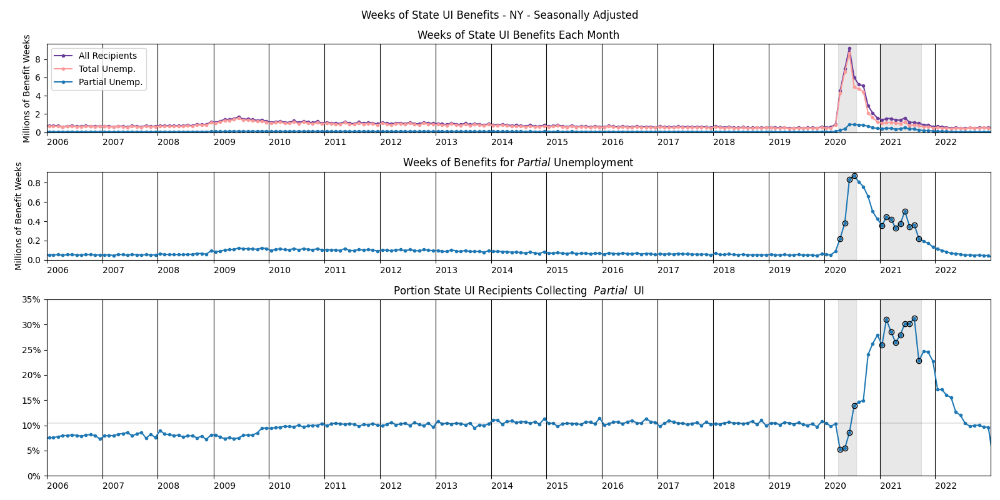

---

### State UI in TX

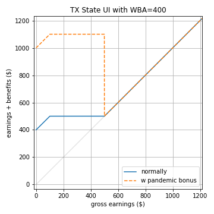

In Texas, the rule is 
- that $b = WBA$ if $w < \frac{WBA}{4}$,
- and $b = \frac{5}{4}WBA - w$ if $\frac{WBA}{4} \leq w \leq \frac{5}{4}WBA$.
- Benefits cut off when $w > \frac{5}{4}WBA$.

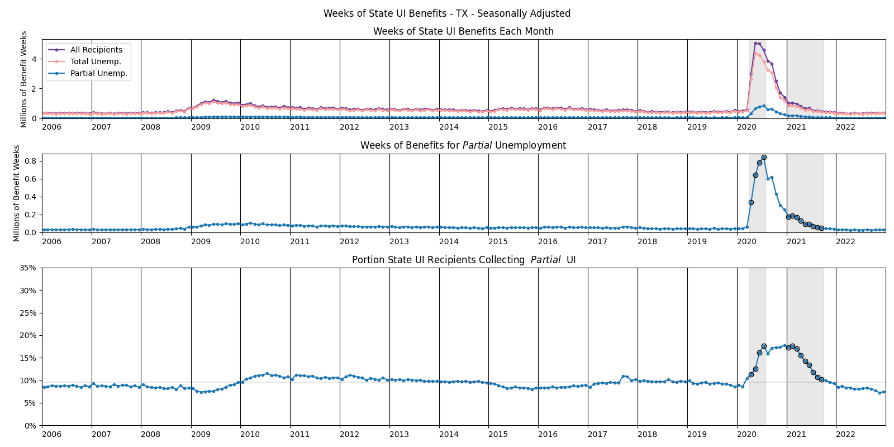

---

### State UI in PA

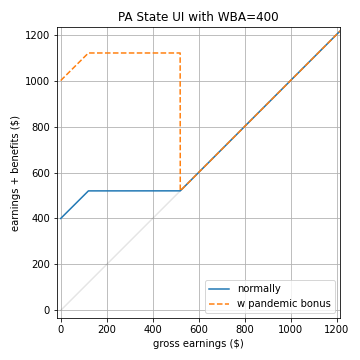

In Pennsylvania, the rule is 
- that $b = WBA$ if $w < 0.3\times WBA$,
- and $b = 1.3 \times WBA - w$ if $0.3\times WBA \leq w \leq 1.3 \times WBA$.
- Benefits cut off when $w > 1.3 \times WBA$.

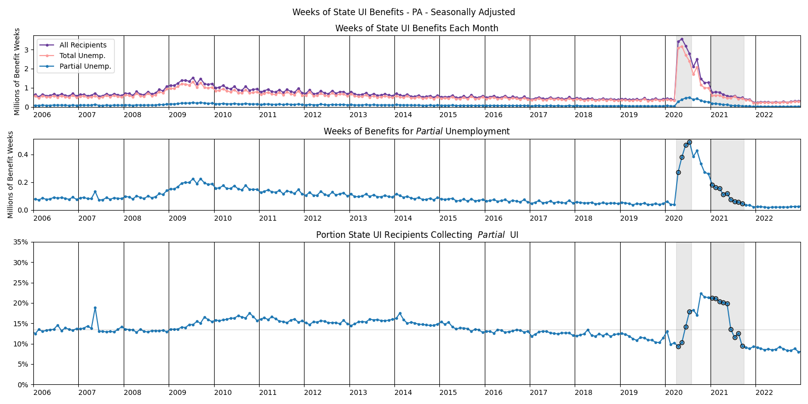

---

### State UI in IL

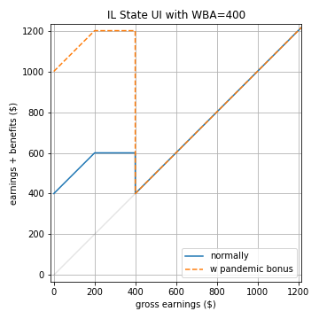

In Illinois, the rule is
- that $b = WBA$ if $w < \frac{WBA}{2}$,
- and $b = \frac{3}{2}WBA - w$ if $\frac{WBA}{2} \leq w < WBA$.
- Benefits cut off when $w \geq WBA$. This means there's a cliff.

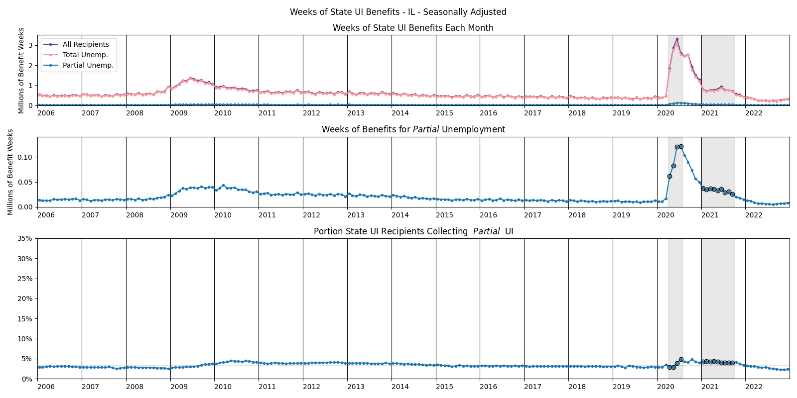

---

### State UI in FL

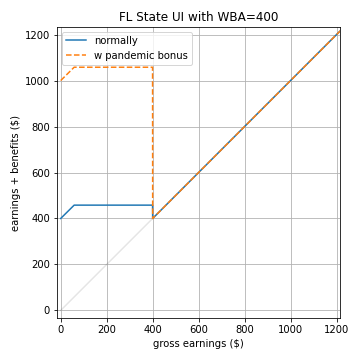

In Florida, the rule is
- that $b = WBA$ if $w < 58$,
- and $b = 58 + WBA - w$ if $58 \leq w < WBA$.
- Benefits cut off when $w \geq WBA$. This means there's a cliff.

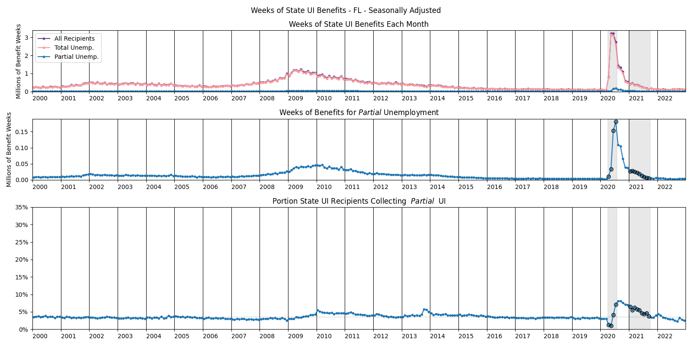

---

### State UI in MN

In Minnesota, the rule is $b = WBA - \frac{w}{2}$ if $w < WBA$.  
Benefits cut off when $w \geq WBA$.

---

layout: true
class: header

## Unemployment insurance in (Sahin et al 2002)

---

### Consumer's choices

The consumer's optimand is straightforward:

$$E \sum_j \beta^j U(c_j,l_j) = E \sum_j \beta^j \frac{(c^{1-\sigma}l^\sigma)^{1-\rho}-1}{1-\rho}$$

Two decisions the consumer faces:

1. How to split income between consumption and (non-interest-bearing) savings
    - budget is $m'+c = m+y_d$, where $m$ is assets, and $y_d$ is disposable income.
    - assets are subject to the constrain $m'\geq 0$

2. Whether to work (when the worker has a job offer)
    - The worker can either choose not not to work, in which case $l=1$
    - or they can choose to work a fixed amount $\hat h (=0.45)$, in which case $l=1-\hat h$
    - Beyond this possible binary decision each period, they can't choose *how much* to work.
 

---

### Model of Job Search

Three more state variables are introduced: $s,\eta,\mu$.

- Employment opportunity $s\in\set{e,u}$ represents whether the person has a job opportunity ($s=e$) or not ($s=u$).
    - $s$ evolves according to a 2x2 transition matrix $\chi$, calibrated like so:

$$\chi = 
\begin{bmatrix}
   \chi(e,e) & \chi(e,u) \\
   \chi(u,e) & \chi(u,u)
\end{bmatrix} =
\begin{bmatrix}
   0.9681 & 0.0319 \\
   0.5 & 0.5
\end{bmatrix}
$$

- employment status $\eta\in\Set{0,1}$ represents whether the person actually works. 
- $\mu\in\set{0,1}$ indicates whether the person collects unemployment benefits.
    - If $(s,\eta)=(e,0)$, there is a probability $\pi(t)$ that the person collects benefits and probability $1-\pi(t)$ they do not.
    - Otherwise, $\mu$ works as you'd expect. 
        - $(s,\eta)=(e,1) \implies \mu=0$, 
        - and $s=u \implies \eta=0, \mu=1$

<!--
- Note that $s=u \implies \eta=0$. But if the person chooses not to accept an employment opportunity, $(s,\eta)=(e,0)$.
-->

---

### Structure of Unemployment Insurance

$$\theta(t) = 
\begin{cases}
    \theta_t & \text{if } t\in\{0,...,T-1\} \\
    \theta_T & \text{if } t\geq T
\end{cases}$$

- Each $\theta$ is a replacement ratio, meaning that a person collecting unemployment insurance receives a fraction of their typical income.
- $t$ is the duration of the person's current unemployment spell. (optimal benefits will taper off)
    - $t$ increments whenever the person does not work ($\eta=0$). And $t=0$ if the person worked last period.
- For tractability the replacement ratio is constant from period $T$ of unemployment onwards.

---

### Disposable Income

$\tau$ is the proportional tax rate.

- If the person is working ($\eta=1$), then disposable income is $y_d=(1-\tau)y$
- If the person isn't working:
    - If they collect benefits, then $y_d=(1-\tau)\theta(t)y$
    - If they don't, then $y_d=0$

<!--(And yes, real-world unemployment benefits are taxed, at least in Minnesota)-->

---

### Value Function

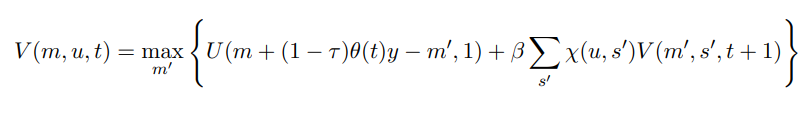

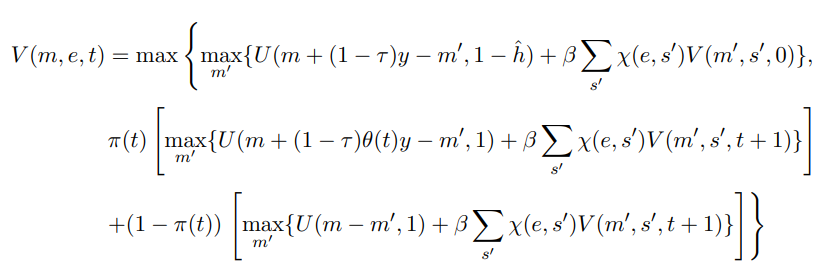

<!--

$$\gdef\CONTINUEUNEMP#1{\beta\sum_{s'}\chi(#1,s')V(m',s',t+1)}$$

$$\gdef\VCOLLECTUI{\max_{m'}\Set{
    U(m+(1-\tau)\theta(t)y-m',1) + \CONTINUEUNEMP{u}}}$$

$$V(m,u,t)=\VCOLLECTUI$$

$$\gdef\VCOLLECTUIalt{\max_{m'}\Set{
    U(y_d(x)+m-m',1) + \CONTINUEUNEMP{u}}}$$

$$V(m,u,t)=\VCOLLECTUIalt$$
-->

---

### Market Clearing and Equilibrium

State of a person is $x=(m,s,t,\mu)$

Stationary equilibrium consists of 
- decision rules $\eta(m,s,t)$, $c(x)$, $m'(x)$
- time-invariant measure $\lambda(x)$ of people in state $x$
- tax rate $\tau$

Such that

- Given $\tau$, the decision rule is optimal for the consumers.
- Goods market clears: $\sum_x \lambda(x) c(x) = \sum_x \lambda(x) \eta(x)y$
- $\lambda(x')=\lambda(x)$
- Government budget  balanced:

$$\sum_{m,t}\lambda(m,e,t,\textcolor{red}{0})\eta(m,e,t)\tau y =
\sum_{m,s,t}\lambda(m,s,t,\textcolor{red}{1})(1-\tau)\theta(t)y$$

---

### Social Planner's Problem

$$\max\sum_{t=0}^\infty \beta^t \lbrack N_t U(c_{1t}, 1-\hat h) + (1-N_t)U(c_{2t},1) \rbrack$$

subject to 

$$N_t c_{1t} +  (1-N_t) c_{2t} \leq N_t y, \;\; N_t \leq \bar N$$

Where 
- $N_t$ is employment rate, 
- $c_{1t}$ is consumption for employed people
- $c_{2t}$ is consumption for unemployed people
- $\bar N$ is set to 0.94

In the following slide, welfare cost of an equilibrium
is given as $1-\phi$,
where $phi$ is the value such that $(\phi c_{1t}, \phi c_{2t})$
gives the same average utility as the equilibrium allocations.

---

### Summary of Optimal Plans

$\pi(1)=1$ for all of the following:

| Case | $\theta$ | emp rate | $1-\phi$ | 
|:-:|:-:|:-:|:-:|
| T=1, No savings, $\pi(0)=0$ | .25 | .94 | 2.50% |
| T=4, No savings, $\pi(0)=0$ | .65, .65, .65, .3 | .90 | 0.485% |
| T=1, No savings, $\pi(0)=1$ | .25 | .94 | 2.50% |
| T=4, No savings, $\pi(0)=1$ | .3, .25, .25., .2 | .94 | 2.50% |
| Savings, no UI | 0 | .94 | 0.683% |
| T=1, Savings, , $\pi(0)=0$ | .05 | .94 | 0.683% |
| T=4, Savings, $\pi(0)=0$ | .95, 0, 0, .1 | .94 | 0.483% |
| T=1, Savings, $\pi(0)=1$ | 0 | .94 | 0.683% |
| T=4, Savings, $\pi(0)=1$ | 0, 0, .05, .05 |  | 0.634% |

