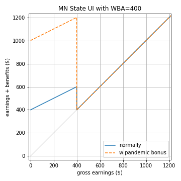

# PUI Presentation, Sept 07, 2023

Robert Winslow

What is the effect of partial unemployment insurance on labor decisions?

---

layout: true
class: header

<h2 style="background-color: #dfd;">Partial Unemployment Insurance in the US</h2>

---

### State UI Recipients Over Time, All US

---

### Partial Unemployment Insurance

- If a person is eligible for UI, a weekly benefit amount (WBA) is determined based on employment history.
  - Except for high earners, it's about half of their typical income.
  - Constant throughout entire UI spell.
- Benefits depend both on the current week's gross earnings, and on the individual's WBA.
  - Your WBA is the amount you collect when totally unemployed.
  - As earnings increase, benefits decrease
  - Details vary by state.
- During the pandemic, the Federal Pandemic Unemployment Compensation supplement (600 then later 300 USD) was paid out in full to anyone collecting even a single dollar of state UI.

---

### Example: State UI Benefits in Minnesota

In Minnesota, the rule is that the benefits for a given week are determined by:

$$
benefits = \begin{cases}
WBA - \frac{earnings}{2} &\text{ if } earnings < WBA \\
0 &\text{ if } earnings \geq WBA \\
\end{cases}
$$

where WBA is weekly benefit amount (person-specific, fixed for entire duration of benefits spell)
and the earnings refers to the current week's labor income before taxes and transfers.

*Figure on right: earnings and benefits for a hypothetical Minnesota worker with a WBA of 400 USD*

<!--TODO: What was YIRU's WBA? I should plug that in here instead of a generic 400.-->

---

### State UI Recipients Over Time, MN

---

---

layout: true
class: header

<h2 style="background-color: #eef;">Model</h2>

---

- Simple model of job search and unemployment insurance.
- Based on:
    - *The role of unemployment insurance in an economy with liquidity constraints and moral hazard* (Hansen, Imrohoroğlu, 1992)
    - *Unemployment insurance and the role of self-insurance.* (Abdulkadiroğlu, Kuruşçu, Şahin, 2002).
- My contribution is the addition of *partial* unemployment insurance.

<!--The following are some global definitions for more concise notation.-->

$$
\gdef\etaE{\text{E}}
\gdef\etaP{\text{P}}
\gdef\etaU{\text{U}}
\gdef\sE{e}
\gdef\sP{p}
\gdef\sU{u}
\gdef\hP{\hat{h}_p}
\gdef\hE{\hat{h}_e}
$$

---

### Consumer's choices

The consumer's optimand is straightforward:

$$\mathbb{E} \sum_j \beta^t U(c_t,l_t) = 
\mathbb{E} \sum_t \beta^t \Big(\frac{c_t^{1-\gamma_c}}{1-\gamma_c} + \psi \cdot \frac{l_t^{1-\gamma_l}}{1-\gamma_l}\Big)$$

Two decisions the consumer faces:

1. How to split income between consumption and (non-interest-bearing) savings
    - budget is $m'+c = m+y_d$, where $m$ is assets, and $y_d$ is disposable income.
    - assets are subject to the constraint $m'\geq 0$

2. Whether and how much to work when give a job opportunity. (See next slide.)

<!--These basics are very similar to (Abdulkadiroğlu, Kuruşçu, Şahin, (2002)).-->

---

### Job Search

- Employment opportunity $s\in\set{e,p,u}$ represents whether the person has a job opportunity ($s=e$), a partial job opportunity ($s=p$) or no job opportunity ($s=u$). (Employment, Partial employment, full Unemployment)
    - $s$ evolves according to a 3x3 transition matrix $\chi$, <!--TODO: Calibrate-->

$$\chi = 
\begin{bmatrix}
   \chi(e,e) & \chi(e,p) & \chi(e,u) \\
   \chi(p,e) & \chi(p,p) & \chi(p,u) \\
   \chi(u,e) & \chi(u,p) & \chi(u,u) 
\end{bmatrix}
$$

- employment status $\eta\in\Set{\etaE,\etaP,\etaU}$ represents the level of work the consumer actually chooses to engage in. 
    - If $s=\sE$, consumer can choose from $\eta\in\Set{\etaE,\etaP,\etaU}$
    - If $s=\sP$, consumer can choose from $\eta\in\Set{\etaP,\etaU}$
    - If $s=\sU$, consumer must choose $\eta = \etaU$

<!--
- Note that $s=u \implies \eta=0$. But if the person chooses not to accept an employment opportunity, $(s,\eta)=(e,0)$.
-->

---

### Unemployment Benefits

$\mu\in\set{0,1}$ is a binary variable indicating whether the person collects unemployment benefits.

- If $s=\sE$, then $\mu=0$
- If $(s,\eta)=(\sP,\etaP)$ or $(\sU,\etaU)$, then $\mu=1$
- If $\eta=\etaU$, but $s\neq\sU$, then $\mu=1$ with probability $\pi_u$, 0 otherwise
- If $\eta=\etaP$, but $s\neq\sP$, then $\mu=1$ with probability $\pi_p$, 0 otherwise

If Consumer collects benefits, the benefits adjust their disposable income to some fraction of employed disposable income, called the "replacement rate".

-  $\theta_p$ is replacement rate for partially employed (when $(\eta,\mu)=(\etaP,1)$)
-  $\theta_u$ is replacement rate for unemployed (when $(\eta,\mu)=(\etaU,1)$)

<!--TODO?: Make pi dependent on s, eta, and previous s or eta?-->

---

### Utility Flows, Income, and Leisure

Given $(m,m',\eta,\mu)$, utility flow is:

$$U\Big(m-m'+y_d(\eta,\mu),\;l(\eta)\Big)$$

where

$$
y_d(\eta,\mu) =
\begin{cases}
   (1-\tau)y                &\text{if } (\eta,\mu)=(\etaE,0) \\
   (1-\tau)yθ_p             &\text{if } (\eta,\mu)=(\etaP,1) \\
   (1-\tau)yθ_u             &\text{if } (\eta,\mu)=(\etaU,1) \\
   (1-\tau)y\frac{\hP}{\hE} &\text{if } (\eta,\mu)=(\etaP,0) \\
   0                        &\text{if } (\eta,\mu)=(\etaU,0) \\
\end{cases}
$$

and

$$
l(\eta) =
\begin{cases}
   1-\hE &\text{if } \eta=\etaE \\
   1-\hP &\text{if } \eta=\etaP \\
   1 &\text{if } \eta=\etaU \\
\end{cases}
$$

---

### Timeline Within Each Period

1. Consumer recieves potential job offer $s\in\set{e,p,u}$
2. Consumer chooses employment status $\eta\in\Set{\etaE,\etaP,\etaU}$
3. Draw $\mu\in\set{0,1}$: does Consumer get unemployment benefits?   
4. Consumer chooses $m'$ after seeing $\mu$

---

### Value Functions

$$
V(e,m) = \max_{\eta\in\set{\etaE,\etaP,\etaU}}\Big\lbrace
\mathbb{E} \left[\max_{m'}\Set{U(m-m'+y_d(\eta,\mu),l(\eta))+cont(e,m')}\right]
\Big\rbrace
$$

$$
V(p,m) = \max_{\eta\in\set{\etaP,\etaU}}\Big\lbrace
\mathbb{E} \left[\max_{m'}\Set{U(m-m'+y_d(\eta,\mu),l(\eta))+cont(p,m')}\right]
\Big\rbrace
$$

$$
V(u,m) = \max_{m'}\Set{U(m-m'+y_d(\eta,\mu),l(\eta))+cont(u,m')}
$$

where

$$cont(s,m') \equiv \beta \sum_{s'}\chi(s,s')V(m',s')$$

---

### Market Clearing and Equilibrium

State of a person is $x=(m,s,\eta,\mu)$

Stationary equilibrium consists of 
- decision rules $\eta(m,s)$, $c(x)$, $m'(x)$
- time-invariant measure $\lambda(x)$ of people in state $x$
- tax rate $\tau$

Such that

- Given $\tau$, the decision rules are optimal for the consumers.
- Goods market clears: 

$$\sum_x \lambda(x) c(x) = \sum_x \lambda(x) \cdot 
\begin{cases}
y                &\text{if }\eta=\etaE\\
\frac{\hP}{\hE}y &\text{if }\eta=\etaP\\
0                &\text{if }\eta=\etaU\\
\end{cases}
$$

- $\lambda(x')=\lambda(x)$
- Government budget  balanced (?):

---

---

---

---

layout: true
class: header

<h2 style="background-color: #dfd;">A match for aggregate E,P,U</h2>

---

---

The following is leftover from previous slides. Left in as testing for now:

---

layout: true
class: header

<h2 style="background-color: #dfd;">Experiment with New Values for χ</h2>

---

For this test, I altered just the last row of χ, 
to decrease the rate at which new full-time employment is found,
and increase the persistance of unemployment.

(Changed values are bolded. See later slide for original.)

$$\chi = 
\begin{bmatrix}
    \chi(e,e) & \chi(e,p) & \chi(e,u) \\
    \chi(p,e) & \chi(p,p) & \chi(p,u) \\
    \chi(u,e) & \chi(u,p) & \chi(u,u) 
\end{bmatrix} = 
\begin{bmatrix}
    0.94 & 0.03 & 0.03 \\
    0.57 & 0.33 & 0.1 \\
    \boldsymbol{0.2} & 0.1 & \boldsymbol{0.7}
\end{bmatrix}
$$

which yields stationary distribution (with perfect enforcement) of:

| E | P | U |
|:-:|:-:|:-:|
| 84.48% | 5.31% | 10.22% |

---

### π=0.2, lower partial hours 12.0 

Basic Version with no bonus:

| π0 | π1 | $\theta$ | bonus | $\tau$ | deficit | mean $U$ | Fully Empl | Partly Empl |
|:-:|:-:|:-:|:-:|:-:|:-:|:-:|:-:|:-:|
| 0.2 | 0.2 | 0.5 | 0 | 5.61% | -0.0 | -0.5562 | 84% | 5% |

Employment rate by income quintile:

| Quintile | 1 | 2 | 3 | 4 | 5 | all |
|:--|:-:|:-:|:-:|:-:|:-:|:-:|
| Weekly Income  | 372 | 592 | 886 | 1280 | 2323 |  |
| **Fully employed**  | **84.5%** | **84.5%** | **84.5%** | **84.5%** | **84.5%** | **84.5%** |
| **Partly employed**  | **5.3%** | **5.3%** | **5.3%** | **5.3%** | **5.3%** | **5.3%** |
| Offered e, chose P  | 0.0% | 0.0% | 0.0% | 0.0% | 0.0% | 0.0% |
| Offered p, chose P  | 5.3% | 5.3% | 5.3% | 5.3% | 5.3% | 5.3% |
| **Unemployed**  | **10.2%** | **10.2%** | **10.2%** | **10.2%** | **10.2%** | **10.2%** |
| Offered e, chose U  | 0.0% | 0.0% | 0.0% | 0.0% | 0.0% | 0.0% |
| Offered p, chose U  | 0.0% | 0.0% | 0.0% | 0.0% | 0.0% | 0.0% |
| Offered u, chose U  | 10.2% | 10.2% | 10.2% | 10.2% | 10.2% | 10.2% |

---

### π=0.2, lower partial hours 12.0 

Now add the 600 dollar bonus without changing tax rate:

| π0 | π1 | $\theta$ | bonus | $\tau$ | deficit | mean $U$ | Fully Empl | Partly Empl |
|:-:|:-:|:-:|:-:|:-:|:-:|:-:|:-:|:-:|
| 0.2 | 0.2 | 0.5 | 600 | 5.61% | 97.46 | -0.4108 | 74% | 16% |

Employment rate by income quintile:

| Quintile | 1 | 2 | 3 | 4 | 5 | all |
|:--|:-:|:-:|:-:|:-:|:-:|:-:|
| Weekly Income  | 372 | 592 | 886 | 1280 | 2323 |  |
| **Fully employed**  | **33.4%** | **83.2%** | **84.5%** | **84.5%** | **84.5%** | **74.0%** |
| **Partly employed**  | **56.4%** | **6.6%** | **5.3%** | **5.3%** | **5.3%** | **15.8%** |
| Offered e, chose P  | 51.1% | 1.3% | 0.0% | 0.0% | 0.0% | 10.5% |
| Offered p, chose P  | 5.3% | 5.3% | 5.3% | 5.3% | 5.3% | 5.3% |
| **Unemployed**  | **10.2%** | **10.2%** | **10.2%** | **10.2%** | **10.2%** | **10.2%** |
| Offered e, chose U  | 0.0% | 0.0% | 0.0% | 0.0% | 0.0% | 0.0% |
| Offered p, chose U  | 0.0% | 0.0% | 0.0% | 0.0% | 0.0% | 0.0% |
| Offered u, chose U  | 10.2% | 10.2% | 10.2% | 10.2% | 10.2% | 10.2% |

---

### π=0.2, lower partial hours 12.0 

Now adjust the taxes to remove the deficit when the bonus is in place:

| π0 | π1 | $\theta$ | bonus | $\tau$ | deficit | mean $U$ | Fully Empl | Partly Empl |
|:-:|:-:|:-:|:-:|:-:|:-:|:-:|:-:|:-:|
| 0.2 | 0.2 | 0.5 | 600 | 15.11% | -0.0 | -0.4997 | 74% | 16% |

Employment rate by income quintile:

| Quintile | 1 | 2 | 3 | 4 | 5 | all |
|:--|:-:|:-:|:-:|:-:|:-:|:-:|
| Weekly Income  | 372 | 592 | 886 | 1280 | 2323 |  |
| **Fully employed**  | **33.1%** | **83.2%** | **84.5%** | **84.5%** | **84.5%** | **73.9%** |
| **Partly employed**  | **56.7%** | **6.6%** | **5.3%** | **5.3%** | **5.3%** | **15.8%** |
| Offered e, chose P  | 51.4% | 1.3% | 0.0% | 0.0% | 0.0% | 10.5% |
| Offered p, chose P  | 5.3% | 5.3% | 5.3% | 5.3% | 5.3% | 5.3% |
| **Unemployed**  | **10.2%** | **10.2%** | **10.2%** | **10.2%** | **10.2%** | **10.2%** |
| Offered e, chose U  | 0.0% | 0.0% | 0.0% | 0.0% | 0.0% | 0.0% |
| Offered p, chose U  | 0.0% | 0.0% | 0.0% | 0.0% | 0.0% | 0.0% |
| Offered u, chose U  | 10.2% | 10.2% | 10.2% | 10.2% | 10.2% | 10.2% |

---

### π=0.3, lower partial hours 12.0 

Basic Version with no bonus:

| π0 | π1 | $\theta$ | bonus | $\tau$ | deficit | mean $U$ | Fully Empl | Partly Empl |
|:-:|:-:|:-:|:-:|:-:|:-:|:-:|:-:|:-:|
| 0.3 | 0.3 | 0.5 | 0 | 5.61% | 0.0 | -0.5561 | 84% | 5% |

Employment rate by income quintile:

| Quintile | 1 | 2 | 3 | 4 | 5 | all |
|:--|:-:|:-:|:-:|:-:|:-:|:-:|
| Weekly Income  | 372 | 592 | 886 | 1280 | 2323 |  |
| **Fully employed**  | **84.5%** | **84.5%** | **84.5%** | **84.5%** | **84.5%** | **84.5%** |
| **Partly employed**  | **5.3%** | **5.3%** | **5.3%** | **5.3%** | **5.3%** | **5.3%** |
| Offered e, chose P  | 0.0% | 0.0% | 0.0% | 0.0% | 0.0% | 0.0% |
| Offered p, chose P  | 5.3% | 5.3% | 5.3% | 5.3% | 5.3% | 5.3% |
| **Unemployed**  | **10.2%** | **10.2%** | **10.2%** | **10.2%** | **10.2%** | **10.2%** |
| Offered e, chose U  | 0.0% | 0.0% | 0.0% | 0.0% | 0.0% | 0.0% |
| Offered p, chose U  | 0.0% | 0.0% | 0.0% | 0.0% | 0.0% | 0.0% |
| Offered u, chose U  | 10.2% | 10.2% | 10.2% | 10.2% | 10.2% | 10.2% |

---

### π=0.3, lower partial hours 12.0 

Now add the 600 dollar bonus without changing tax rate:

| π0 | π1 | $\theta$ | bonus | $\tau$ | deficit | mean $U$ | Fully Empl | Partly Empl |
|:-:|:-:|:-:|:-:|:-:|:-:|:-:|:-:|:-:|
| 0.3 | 0.3 | 0.5 | 600 | 5.61% | 132.9 | -0.3732 | 62% | 23% |

Employment rate by income quintile:

| Quintile | 1 | 2 | 3 | 4 | 5 | all |
|:--|:-:|:-:|:-:|:-:|:-:|:-:|
| Weekly Income  | 372 | 592 | 886 | 1280 | 2323 |  |
| **Fully employed**  | **1.8%** | **55.8%** | **84.5%** | **84.5%** | **84.5%** | **62.2%** |
| **Partly employed**  | **64.5%** | **33.9%** | **5.3%** | **5.3%** | **5.3%** | **22.9%** |
| Offered e, chose P  | 59.2% | 28.6% | 0.0% | 0.0% | 0.0% | 17.6% |
| Offered p, chose P  | 5.3% | 5.3% | 5.3% | 5.3% | 5.3% | 5.3% |
| **Unemployed**  | **33.7%** | **10.3%** | **10.2%** | **10.2%** | **10.2%** | **14.9%** |
| Offered e, chose U  | 23.5% | 0.1% | 0.0% | 0.0% | 0.0% | 4.7% |
| Offered p, chose U  | 0.0% | 0.0% | 0.0% | 0.0% | 0.0% | 0.0% |
| Offered u, chose U  | 10.2% | 10.2% | 10.2% | 10.2% | 10.2% | 10.2% |

---

### π=0.3, lower partial hours 12.0 

Now adjust the taxes to remove the deficit when the bonus is in place:

| π0 | π1 | $\theta$ | bonus | $\tau$ | deficit | mean $U$ | Fully Empl | Partly Empl |
|:-:|:-:|:-:|:-:|:-:|:-:|:-:|:-:|:-:|
| 0.3 | 0.3 | 0.5 | 600 | 18.22% | -0.0 | -0.4901 | 62% | 23% |

Employment rate by income quintile:

| Quintile | 1 | 2 | 3 | 4 | 5 | all |
|:--|:-:|:-:|:-:|:-:|:-:|:-:|
| Weekly Income  | 372 | 592 | 886 | 1280 | 2323 |  |
| **Fully employed**  | **1.7%** | **55.6%** | **84.5%** | **84.5%** | **84.5%** | **62.1%** |
| **Partly employed**  | **62.8%** | **34.0%** | **5.3%** | **5.3%** | **5.3%** | **22.5%** |
| Offered e, chose P  | 57.5% | 28.7% | 0.0% | 0.0% | 0.0% | 17.2% |
| Offered p, chose P  | 5.3% | 5.3% | 5.3% | 5.3% | 5.3% | 5.3% |
| **Unemployed**  | **35.5%** | **10.5%** | **10.2%** | **10.2%** | **10.2%** | **15.3%** |
| Offered e, chose U  | 25.3% | 0.3% | 0.0% | 0.0% | 0.0% | 5.1% |
| Offered p, chose U  | 0.0% | 0.0% | 0.0% | 0.0% | 0.0% | 0.0% |
| Offered u, chose U  | 10.2% | 10.2% | 10.2% | 10.2% | 10.2% | 10.2% |

---

layout: true
class: header

<h2 style="background-color: #fdd;">With Original Values for χ</h2>

---

This uses the value fo χ used in previous experiments:

$$\chi = 
\begin{bmatrix}
    \chi(e,e) & \chi(e,p) & \chi(e,u) \\
    \chi(p,e) & \chi(p,p) & \chi(p,u) \\
    \chi(u,e) & \chi(u,p) & \chi(u,u) 
\end{bmatrix} = 
\begin{bmatrix}
    0.94 & 0.03 & 0.03 \\
    0.57 & 0.33 & 0.1 \\
    0.4 & 0.1 & 0.5
\end{bmatrix}
$$

which yields stationary distribution (with perfect enforcement) of:

| E | P | U |
|:-:|:-:|:-:|
| 88.77% | 4.92% | 6.31% |

---

### π=0.2, lower partial hours: 12

Basic Version with no bonus:

| π0 | π1 | $\theta$ | bonus | $\tau$ | deficit | mean $U$ | Fully Empl | Partly Empl |
|:-:|:-:|:-:|:-:|:-:|:-:|:-:|:-:|:-:|
| 0.2 | 0.2 | 0.5 | 0 | 3.38% | 0.0 | -0.5323 | 89% | 5% |

Employment rate by income quintile:

| Quintile | 1 | 2 | 3 | 4 | 5 | all |
|:--|:-:|:-:|:-:|:-:|:-:|:-:|
| Weekly Income  | 372 | 592 | 886 | 1280 | 2323 |  |
| **Fully employed**  | **88.8%** | **88.8%** | **88.8%** | **88.8%** | **88.8%** | **88.8%** |
| **Partly employed**  | **4.9%** | **4.9%** | **4.9%** | **4.9%** | **4.9%** | **4.9%** |
| Offered e, chose P  | 0.0% | 0.0% | 0.0% | 0.0% | 0.0% | 0.0% |
| Offered p, chose P  | 4.9% | 4.9% | 4.9% | 4.9% | 4.9% | 4.9% |
| **Unemployed**  | **6.3%** | **6.3%** | **6.3%** | **6.3%** | **6.3%** | **6.3%** |
| Offered e, chose U  | 0.0% | 0.0% | 0.0% | 0.0% | 0.0% | 0.0% |
| Offered p, chose U  | 0.0% | 0.0% | 0.0% | 0.0% | 0.0% | 0.0% |
| Offered u, chose U  | 6.3% | 6.3% | 6.3% | 6.3% | 6.3% | 6.3% |

---

### π=0.2, lower partial hours: 12

Now add the 600 dollar bonus without changing tax rate:

| π0 | π1 | $\theta$ | bonus | $\tau$ | deficit | mean $U$ | Fully Empl | Partly Empl |
|:-:|:-:|:-:|:-:|:-:|:-:|:-:|:-:|:-:|
| 0.2 | 0.2 | 0.5 | 600 | 3.38% | 79.74 | -0.4262 | 80% | 14% |

Employment rate by income quintile:

| Quintile | 1 | 2 | 3 | 4 | 5 | all |
|:--|:-:|:-:|:-:|:-:|:-:|:-:|
| Weekly Income  | 372 | 592 | 886 | 1280 | 2323 |  |
| **Fully employed**  | **43.3%** | **88.7%** | **88.8%** | **88.8%** | **88.8%** | **79.7%** |
| **Partly employed**  | **50.4%** | **5.0%** | **4.9%** | **4.9%** | **4.9%** | **14.0%** |
| Offered e, chose P  | 45.4% | 0.1% | 0.0% | 0.0% | 0.0% | 9.1% |
| Offered p, chose P  | 4.9% | 4.9% | 4.9% | 4.9% | 4.9% | 4.9% |
| **Unemployed**  | **6.3%** | **6.3%** | **6.3%** | **6.3%** | **6.3%** | **6.3%** |
| Offered e, chose U  | 0.0% | 0.0% | 0.0% | 0.0% | 0.0% | 0.0% |
| Offered p, chose U  | 0.0% | 0.0% | 0.0% | 0.0% | 0.0% | 0.0% |
| Offered u, chose U  | 6.3% | 6.3% | 6.3% | 6.3% | 6.3% | 6.3% |

---

### π=0.2, lower partial hours: 12

Now adjust the taxes to remove the deficit when the bonus is in place:

| π0 | π1 | $\theta$ | bonus | $\tau$ | deficit | mean $U$ | Fully Empl | Partly Empl |
|:-:|:-:|:-:|:-:|:-:|:-:|:-:|:-:|:-:|
| 0.2 | 0.2 | 0.5 | 600 | 10.53% | 0.0 | -0.491 | 80% | 14% |

Employment rate by income quintile:

| Quintile | 1 | 2 | 3 | 4 | 5 | all |
|:--|:-:|:-:|:-:|:-:|:-:|:-:|
| Weekly Income  | 372 | 592 | 886 | 1280 | 2323 |  |
| **Fully employed**  | **43.2%** | **88.7%** | **88.8%** | **88.8%** | **88.8%** | **79.7%** |
| **Partly employed**  | **50.5%** | **5.0%** | **4.9%** | **4.9%** | **4.9%** | **14.0%** |
| Offered e, chose P  | 45.5% | 0.1% | 0.0% | 0.0% | 0.0% | 9.1% |
| Offered p, chose P  | 4.9% | 4.9% | 4.9% | 4.9% | 4.9% | 4.9% |
| **Unemployed**  | **6.3%** | **6.3%** | **6.3%** | **6.3%** | **6.3%** | **6.3%** |
| Offered e, chose U  | 0.0% | 0.0% | 0.0% | 0.0% | 0.0% | 0.0% |
| Offered p, chose U  | 0.0% | 0.0% | 0.0% | 0.0% | 0.0% | 0.0% |
| Offered u, chose U  | 6.3% | 6.3% | 6.3% | 6.3% | 6.3% | 6.3% |

---

### π=0.3, lower partial hours: 12

Basic Version with no bonus:

| π0 | π1 | $\theta$ | bonus | $\tau$ | deficit | mean $U$ | Fully Empl | Partly Empl |
|:-:|:-:|:-:|:-:|:-:|:-:|:-:|:-:|:-:|
| 0.3 | 0.3 | 0.5 | 0 | 3.38% | -0.0 | -0.5323 | 89% | 5% |

Employment rate by income quintile:

| Quintile | 1 | 2 | 3 | 4 | 5 | all |
|:--|:-:|:-:|:-:|:-:|:-:|:-:|
| Weekly Income  | 372 | 592 | 886 | 1280 | 2323 |  |
| **Fully employed**  | **88.8%** | **88.8%** | **88.8%** | **88.8%** | **88.8%** | **88.8%** |
| **Partly employed**  | **4.9%** | **4.9%** | **4.9%** | **4.9%** | **4.9%** | **4.9%** |
| Offered e, chose P  | 0.0% | 0.0% | 0.0% | 0.0% | 0.0% | 0.0% |
| Offered p, chose P  | 4.9% | 4.9% | 4.9% | 4.9% | 4.9% | 4.9% |
| **Unemployed**  | **6.3%** | **6.3%** | **6.3%** | **6.3%** | **6.3%** | **6.3%** |
| Offered e, chose U  | 0.0% | 0.0% | 0.0% | 0.0% | 0.0% | 0.0% |
| Offered p, chose U  | 0.0% | 0.0% | 0.0% | 0.0% | 0.0% | 0.0% |
| Offered u, chose U  | 6.3% | 6.3% | 6.3% | 6.3% | 6.3% | 6.3% |

---

### π=0.3, lower partial hours: 12

Now add the 600 dollar bonus without changing tax rate:

| π0 | π1 | $\theta$ | bonus | $\tau$ | deficit | mean $U$ | Fully Empl | Partly Empl |
|:-:|:-:|:-:|:-:|:-:|:-:|:-:|:-:|:-:|
| 0.3 | 0.3 | 0.5 | 600 | 3.38% | 106.32 | -0.3858 | 67% | 24% |

Employment rate by income quintile:

| Quintile | 1 | 2 | 3 | 4 | 5 | all |
|:--|:-:|:-:|:-:|:-:|:-:|:-:|
| Weekly Income  | 372 | 592 | 886 | 1280 | 2323 |  |
| **Fully employed**  | **1.9%** | **66.9%** | **88.8%** | **88.8%** | **88.8%** | **67.0%** |
| **Partly employed**  | **78.2%** | **26.8%** | **4.9%** | **4.9%** | **4.9%** | **23.9%** |
| Offered e, chose P  | 73.2% | 21.8% | 0.0% | 0.0% | 0.0% | 19.0% |
| Offered p, chose P  | 4.9% | 4.9% | 4.9% | 4.9% | 4.9% | 4.9% |
| **Unemployed**  | **19.9%** | **6.3%** | **6.3%** | **6.3%** | **6.3%** | **9.0%** |
| Offered e, chose U  | 13.6% | 0.0% | 0.0% | 0.0% | 0.0% | 2.7% |
| Offered p, chose U  | 0.0% | 0.0% | 0.0% | 0.0% | 0.0% | 0.0% |
| Offered u, chose U  | 6.3% | 6.3% | 6.3% | 6.3% | 6.3% | 6.3% |

---

### π=0.3, lower partial hours: 12

Now adjust the taxes to remove the deficit when the bonus is in place:

| π0 | π1 | $\theta$ | bonus | $\tau$ | deficit | mean $U$ | Fully Empl | Partly Empl |
|:-:|:-:|:-:|:-:|:-:|:-:|:-:|:-:|:-:|
| 0.3 | 0.3 | 0.5 | 600 | 13.47% | 0.0 | -0.4762 | 67% | 24% |

Employment rate by income quintile:

| Quintile | 1 | 2 | 3 | 4 | 5 | all |
|:--|:-:|:-:|:-:|:-:|:-:|:-:|
| Weekly Income  | 372 | 592 | 886 | 1280 | 2323 |  |
| **Fully employed**  | **1.8%** | **67.3%** | **88.8%** | **88.8%** | **88.8%** | **67.1%** |
| **Partly employed**  | **78.7%** | **26.4%** | **4.9%** | **4.9%** | **4.9%** | **24.0%** |
| Offered e, chose P  | 73.7% | 21.5% | 0.0% | 0.0% | 0.0% | 19.0% |
| Offered p, chose P  | 4.9% | 4.9% | 4.9% | 4.9% | 4.9% | 4.9% |
| **Unemployed**  | **19.5%** | **6.3%** | **6.3%** | **6.3%** | **6.3%** | **8.9%** |
| Offered e, chose U  | 13.2% | 0.0% | 0.0% | 0.0% | 0.0% | 2.6% |
| Offered p, chose U  | 0.0% | 0.0% | 0.0% | 0.0% | 0.0% | 0.0% |
| Offered u, chose U  | 6.3% | 6.3% | 6.3% | 6.3% | 6.3% | 6.3% |

---

layout: true

## Comparison of Results from two example χ:

Below, χ1 refers to the original χ (pink slides),
while χ2 refers to the modified χ (green slides).

---

Basic Version, no bonus:

| | E | P | U |
|:-:|:-:|:-:|:-:|
| χ1, π=0.2 | 88.8% | 4.9% | 6.3% |
| χ2, π=0.2 | 84.5% | 5.3% | 10.2% |
| χ1, π=0.3 | 88.8% | 4.9% | 6.3% |
| χ2, π=0.3 | 84.5% | 5.3% | 10.2% |

---

Now add the 600 dollar bonus without changing tax rate:

| | E | P | U |
|:-:|:-:|:-:|:-:|
| χ1, π=0.2 | 79.7% | 14.0% | 6.3% |
| χ2, π=0.2 | 74.0% | 15.8% | 10.2% |
| χ1, π=0.3 | 67.0% | 23.9% | 9.0% |
| χ2, π=0.3 | 62.2% | 22.9% | 14.9% |

---

Now adjust the taxes to remove the deficit when the bonus is in place:

| | E | P | U |
|:-:|:-:|:-:|:-:|
| χ1, π=0.2 | 79.7% | 14.0% | 6.3% |
| χ2, π=0.2 | 73.9% | 15.8% | 10.2% |
| χ1, π=0.3 | 67.1% | 24.0% | 8.9% |
| χ2, π=0.3 | 62.1% | 22.5% | 15.3% |

---

layout: true

## Some Empirical Notes:

---

### Average Hours for Part-time workers

- Average hours for part-time workers in CPS data: 22-23 hours.
- But CPS defines part-time as no more than 35 hours per week.
- Conditional on working 1-20 hours, the average is 14-15.
- So lower value for $ĥ_p$ is reasonable.

---

### Labor Market Composition Over Time

The following graph ignores those not at work or not in the labor force:

<!---->

---

### Does Part-Time employment have a spike like PUI?

- During the pandemic, both full and partial UI spiked upwards. Moreover, PUI increased as a *share* of total UI benefits.
- In CPS, part-time employment did spike upwards, but relatively less than unemployment did. This results in the opposite pattern in ratio of P to U as seen in UI.

---

### Does Part-Time employment have a spike like PUI?

- During the pandemic, both full and partial UI spiked upwards. Moreover, PUI increased as a *share* of total UI benefits.
- In CPS, part-time employment did spike upwards, but relatively less than unemployment did. This results in the opposite pattern in ratio of P to U as seen in UI.

(Above: Same graph but with part-time work restricted to those who work 20 hours or less.)

