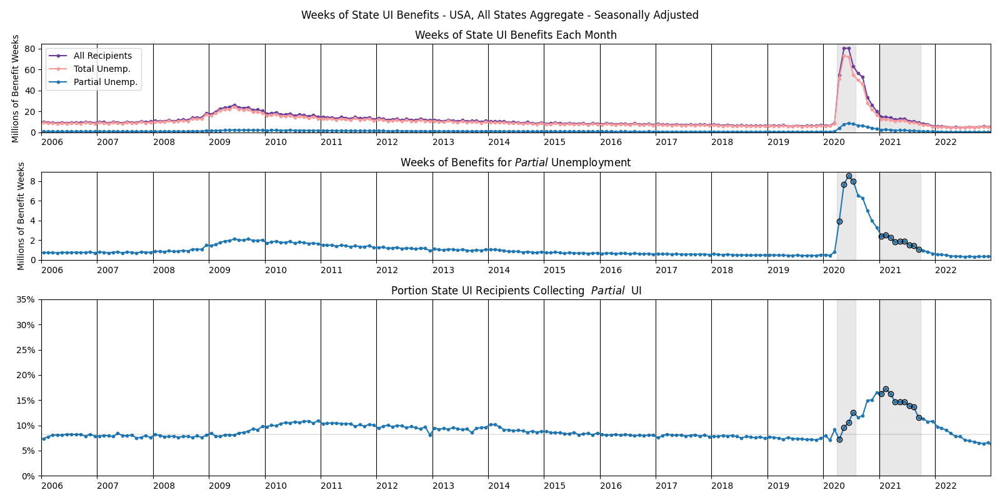
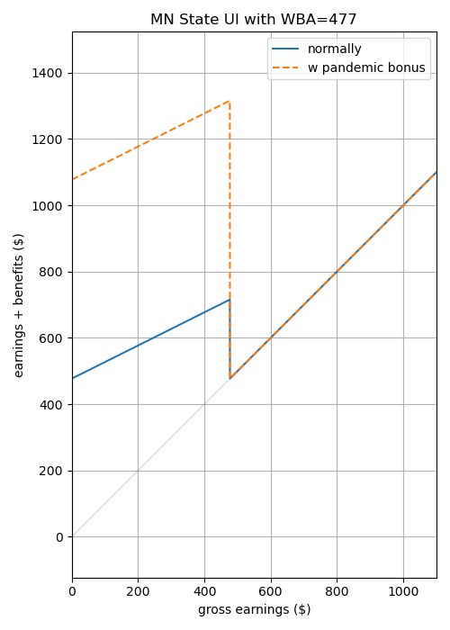
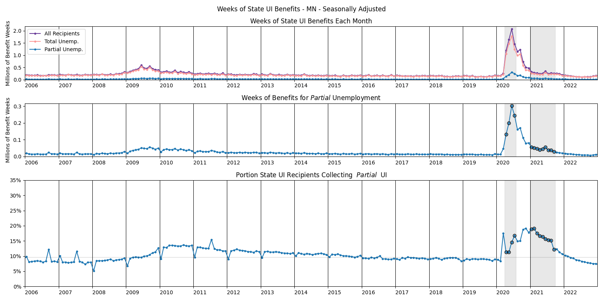

class:middle

# PUI Presentation, Sept 07, 2023

Robert Winslow

What is the effect of partial unemployment insurance on labor decisions?

---

layout: true
class: header

<h2 style="background-color: #dfd;">Partial Unemployment Insurance in the US</h2>

---

### State UI Recipients Over Time, All US

---

### Partial Unemployment Insurance

- If a person is eligible for UI, a weekly benefit amount (WBA) is determined based on employment history.
  - Except for high earners, it's about half of their typical income.
  - Constant throughout entire UI spell.
- Benefits depend both on the current week's gross earnings, and on the individual's WBA.
  - Your WBA is the amount you collect when totally unemployed.
  - As earnings increase, benefits decrease
  - Details vary by state.
- During the pandemic, the Federal Pandemic Unemployment Compensation supplement (600 then later 300 USD) was paid out in full to anyone collecting even a single dollar of state UI.

---

### Example: State UI Benefits in Minnesota

In Minnesota, the rule is that the benefits for a given week are determined by:

$$
benefits = \begin{cases}
WBA - \frac{earnings}{2} &\text{ if } earnings < WBA \\
0 &\text{ if } earnings \geq WBA \\
\end{cases}
$$

where WBA is weekly benefit amount (person-specific, fixed for entire duration of benefits spell)
and the earnings refers to the current week's labor income before taxes and transfers.

*Figure on right: earnings and benefits for a hypothetical Minnesota worker with a WBA of 400 USD*

---

### State UI Recipients Over Time, MN

---

---

layout: true
class: header

<h2 style="background-color: #eef;">Model</h2>

---

- Simple model of job search and unemployment insurance.
- Based on:
    - *The role of unemployment insurance in an economy with liquidity constraints and moral hazard* (Hansen, Imrohoroğlu, 1992)
    - *Unemployment insurance and the role of self-insurance.* (Abdulkadiroğlu, Kuruşçu, Şahin, 2002).
- My contribution is the addition of *partial* unemployment insurance.

<!--The following are some global definitions for more concise notation.-->

$$
\gdef\etaE{\text{E}}
\gdef\etaP{\text{P}}
\gdef\etaU{\text{U}}
\gdef\sE{e}
\gdef\sP{p}
\gdef\sU{u}
\gdef\hP{\hat{h}_p}
\gdef\hE{\hat{h}_e}
$$

---

### Consumer's choices

The consumer's optimand is straightforward:

$$\mathbb{E} \sum_j \beta^t U(c_t,l_t) = 
\mathbb{E} \sum_t \beta^t \Big(\frac{c_t^{1-\gamma_c}}{1-\gamma_c} + \psi \cdot \frac{l_t^{1-\gamma_l}}{1-\gamma_l}\Big)$$

Two decisions the consumer faces:

1. How to split income between consumption and (non-interest-bearing) savings
    - budget is $m'+c = m+y_d$, where $m$ is assets, and $y_d$ is disposable income.
    - assets are subject to the constraint $m'\geq 0$

2. Whether and how much to work when give a job opportunity. (See next slide.)

<!--These basics are very similar to (Abdulkadiroğlu, Kuruşçu, Şahin, (2002)).-->

---

### Job Search

- Employment opportunity $s\in\set{e,p,u}$ represents whether the person has a job opportunity ($s=e$), a partial job opportunity ($s=p$) or no job opportunity ($s=u$). (Employment, Partial employment, full Unemployment)
    - $s$ evolves according to a 3x3 transition matrix $\chi$, <!--TODO: Calibrate-->

$$\chi = 
\begin{bmatrix}
   \chi(e,e) & \chi(e,p) & \chi(e,u) \\
   \chi(p,e) & \chi(p,p) & \chi(p,u) \\
   \chi(u,e) & \chi(u,p) & \chi(u,u) 
\end{bmatrix}
$$

- employment status $\eta\in\Set{\etaE,\etaP,\etaU}$ represents the level of work the consumer actually chooses to engage in. 
    - If $s=\sE$, consumer can choose from $\eta\in\Set{\etaE,\etaP,\etaU}$
    - If $s=\sP$, consumer can choose from $\eta\in\Set{\etaP,\etaU}$
    - If $s=\sU$, consumer must choose $\eta = \etaU$

<!--
- Note that $s=u \implies \eta=0$. But if the person chooses not to accept an employment opportunity, $(s,\eta)=(e,0)$.
-->

---

### Unemployment Benefits

$\mu\in\set{0,1}$ is a binary variable indicating whether the person collects unemployment benefits.

- If $s=\sE$, then $\mu=0$
- If $(s,\eta)=(\sP,\etaP)$ or $(\sU,\etaU)$, then $\mu=1$
- If $\eta=\etaU$, but $s\neq\sU$, then $\mu=1$ with probability $\pi_u$, 0 otherwise
- If $\eta=\etaP$, but $s\neq\sP$, then $\mu=1$ with probability $\pi_p$, 0 otherwise

If Consumer collects benefits, the benefits adjust their disposable income to some fraction of employed disposable income, called the "replacement rate".

-  $\theta_p$ is replacement rate for partially employed (when $(\eta,\mu)=(\etaP,1)$)
-  $\theta_u$ is replacement rate for unemployed (when $(\eta,\mu)=(\etaU,1)$)

<!--TODO?: Make pi dependent on s, eta, and previous s or eta?-->

---

### Utility Flows, Income, and Leisure

Given $(m,m',\eta,\mu)$, utility flow is:

$$U\Big(m-m'+y_d(\eta,\mu),\;l(\eta)\Big)$$

where

$$
y_d(\eta,\mu) =
\begin{cases}
   (1-\tau)y                &\text{if } (\eta,\mu)=(\etaE,0) \\
   (1-\tau)yθ_p             &\text{if } (\eta,\mu)=(\etaP,1) \\
   (1-\tau)yθ_u             &\text{if } (\eta,\mu)=(\etaU,1) \\
   (1-\tau)y\frac{\hP}{\hE} &\text{if } (\eta,\mu)=(\etaP,0) \\
   0                        &\text{if } (\eta,\mu)=(\etaU,0) \\
\end{cases}
$$

and

$$
l(\eta) =
\begin{cases}
   1-\hE &\text{if } \eta=\etaE \\
   1-\hP &\text{if } \eta=\etaP \\
   1 &\text{if } \eta=\etaU \\
\end{cases}
$$

---

### Timeline Within Each Period

1. Consumer recieves potential job offer $s\in\set{e,p,u}$
2. Consumer chooses employment status $\eta\in\Set{\etaE,\etaP,\etaU}$
3. Draw $\mu\in\set{0,1}$: does Consumer get unemployment benefits?   
4. Consumer chooses $m'$ after seeing $\mu$

---

### Value Functions

$$
V(e,m) = \max_{\eta\in\set{\etaE,\etaP,\etaU}}\Big\lbrace
\mathbb{E} \left[\max_{m'}\Set{U(m-m'+y_d(\eta,\mu),l(\eta))+cont(e,m')}\right]
\Big\rbrace
$$

$$
V(p,m) = \max_{\eta\in\set{\etaP,\etaU}}\Big\lbrace
\mathbb{E} \left[\max_{m'}\Set{U(m-m'+y_d(\eta,\mu),l(\eta))+cont(p,m')}\right]
\Big\rbrace
$$

$$
V(u,m) = \max_{m'}\Set{U(m-m'+y_d(\eta,\mu),l(\eta))+cont(u,m')}
$$

where

$$cont(s,m') \equiv \beta \sum_{s'}\chi(s,s')V(m',s')$$

---

### Market Clearing and Equilibrium

State of a person is $x=(m,s,\eta,\mu)$

Stationary equilibrium consists of 
- decision rules $\eta(m,s)$, $c(x)$, $m'(x)$
- time-invariant measure $\lambda(x)$ of people in state $x$
- tax rate $\tau$

Such that

- Given $\tau$, the decision rules are optimal for the consumers.
- Goods market clears: 

$$\sum_x \lambda(x) c(x) = \sum_x \lambda(x) \cdot 
\begin{cases}
y                &\text{if }\eta=\etaE\\
\frac{\hP}{\hE}y &\text{if }\eta=\etaP\\
0                &\text{if }\eta=\etaU\\
\end{cases}
$$

- $\lambda(x')=\lambda(x)$
- Government budget balanced (?)

---------------

### Adding heterogeneity to the model.

In *US unemployment insurance replacement rates during the pandemic* (Ganong, Noel, and Vavra, 2020), 
the authors use CPS data to estimate the income distribution of 
workers benefitting from the Pandemic Unemployment Compensation.

| Quintile | 1 | 2 | 3 | 4 | 5 |
|:--|:-:|:-:|:-:|:-:|:-:|
| Pre-pandemic Weekly Income  | 372 | 592 | 886 | 1280 | 2323 |
| May 2020 Unemp Rate, estimated  | 19.9% | 12.8% | 8.0% | 6.2% | 3.8% |

*From Table 1 from (Ganong, Noel, and Vavra, 2020)*

### Adding this to model:

- 5 'types' of people corresponding to these income quintiles.
- Income scaled so that 886 corresponds to y=1

--------------

---

layout: true
class: header

<h2 style="background-color: #fee;">Calibration</h2>

---

### Calibrating χ

I set

$$\chi = 
\begin{bmatrix}
   \chi(e,e) & \chi(e,p) & \chi(e,u) \\
   \chi(p,e) & \chi(p,p) & \chi(p,u) \\
   \chi(u,e) & \chi(u,p) & \chi(u,u) 
\end{bmatrix}
=
\begin{bmatrix}
   0.94 & 0.03 & 0.03 \\
   0.57 & 0.33 & 0.10 \\
   0.40 & 0.10 & 0.50 
\end{bmatrix}
$$

Which has stationary distribution $[0.89, 0.05, 0.06]$.

---

### Calibrating working time

- $\hE$ is set to $0.45$, representing a full work week of 45 hours out of possible 100.
- And time spent for part-time work is set to $\hP=0.12$.

<!--- $\hE=0.45$ (time Spent for full time work.)-->

---

### Other parameters:

These use the same values as (Hansen, Imrohoroğlu, 1992) and :

- $\beta=0.995$ (time discount factor). Same as (Şahin et al, 2002)
- $\psi=0.35$ 
- $\gamma_c=0.5$ 
- $\gamma_l=2$ 

$$\mathbb{E} \sum_j \beta^t U(c_t,l_t) = 
\mathbb{E} \sum_t \beta^t \Big(\frac{c_t^{1-\gamma_c}}{1-\gamma_c} + \psi \cdot \frac{l_t^{1-\gamma_l}}{1-\gamma_l}\Big)$$

---

layout: true
class: header

<h2 style="background-color: #fdd;">A Little Experiment</h2>

---

### ψ=0.35, γc=0.5, γl=0.5, π=0.2

Basic Version with no bonus:

| π0 | π1 | ĥP | $\theta$ | bonus | $\tau$ | deficit | mean $U$ | Fully Empl | Partly Empl |
|:-:|:-:|:-:|:-:|:-:|:-:|:-:|:-:|:-:|:-:|
| 0.2 | 0.2 | 12 | 0.5 | 0 | 3.38% | -0.0 | 0.6299 | 89% | 5% |

Employment rate by income quintile:

| Quintile | 1 | 2 | 3 | 4 | 5 | all |
|:--|:-:|:-:|:-:|:-:|:-:|:-:|
| Weekly Income  | 372 | 592 | 886 | 1280 | 2323 |  |
| **Fully employed**  | **88.8%** | **88.8%** | **88.8%** | **88.8%** | **88.8%** | **88.8%** |
| **Partly employed**  | **4.9%** | **4.9%** | **4.9%** | **4.9%** | **4.9%** | **4.9%** |
| Offered e, chose P  | 0.0% | 0.0% | 0.0% | 0.0% | 0.0% | 0.0% |
| Offered p, chose P  | 4.9% | 4.9% | 4.9% | 4.9% | 4.9% | 4.9% |
| **Unemployed**  | **6.3%** | **6.3%** | **6.3%** | **6.3%** | **6.3%** | **6.3%** |
| Offered e, chose U  | 0.0% | 0.0% | 0.0% | 0.0% | 0.0% | 0.0% |
| Offered p, chose U  | 0.0% | 0.0% | 0.0% | 0.0% | 0.0% | 0.0% |
| Offered u, chose U  | 6.3% | 6.3% | 6.3% | 6.3% | 6.3% | 6.3% |

---

### ψ=0.35, γc=0.5, γl=0.5, π=0.2

Now add the 600 dollar bonus without changing tax rate:

| π0 | π1 | ĥP | $\theta$ | bonus | $\tau$ | deficit | mean $U$ | Fully Empl | Partly Empl |
|:-:|:-:|:-:|:-:|:-:|:-:|:-:|:-:|:-:|:-:|
| 0.2 | 0.2 | 12 | 0.5 | 600 | 3.38% | 92.92 | 0.692 | 72% | 22% |

Employment rate by income quintile:

| Quintile | 1 | 2 | 3 | 4 | 5 | all |
|:--|:-:|:-:|:-:|:-:|:-:|:-:|
| Weekly Income  | 372 | 592 | 886 | 1280 | 2323 |  |
| **Fully employed**  | **3.6%** | **88.7%** | **88.8%** | **88.8%** | **88.8%** | **71.7%** |
| **Partly employed**  | **90.1%** | **5.0%** | **4.9%** | **4.9%** | **4.9%** | **22.0%** |
| Offered e, chose P  | 85.2% | 0.1% | 0.0% | 0.0% | 0.0% | 17.0% |
| Offered p, chose P  | 4.9% | 4.9% | 4.9% | 4.9% | 4.9% | 4.9% |
| **Unemployed**  | **6.3%** | **6.3%** | **6.3%** | **6.3%** | **6.3%** | **6.3%** |
| Offered e, chose U  | 0.0% | 0.0% | 0.0% | 0.0% | 0.0% | 0.0% |
| Offered p, chose U  | 0.0% | 0.0% | 0.0% | 0.0% | 0.0% | 0.0% |
| Offered u, chose U  | 6.3% | 6.3% | 6.3% | 6.3% | 6.3% | 6.3% |

---

### ψ=0.35, γc=0.5, γl=0.5, π=0.2

Now adjust the taxes to remove the deficit when the bonus is in place:

| π0 | π1 | ĥP | $\theta$ | bonus | $\tau$ | deficit | mean $U$ | Fully Empl | Partly Empl |
|:-:|:-:|:-:|:-:|:-:|:-:|:-:|:-:|:-:|:-:|
| 0.2 | 0.2 | 12 | 0.5 | 600 | 11.62% | -0.0 | 0.6373 | 71% | 22% |

Employment rate by income quintile:

| Quintile | 1 | 2 | 3 | 4 | 5 | all |
|:--|:-:|:-:|:-:|:-:|:-:|:-:|
| Weekly Income  | 372 | 592 | 886 | 1280 | 2323 |  |
| **Fully employed**  | **3.0%** | **87.1%** | **88.8%** | **88.8%** | **88.8%** | **71.3%** |
| **Partly employed**  | **90.7%** | **6.6%** | **4.9%** | **4.9%** | **4.9%** | **22.4%** |
| Offered e, chose P  | 85.8% | 1.7% | 0.0% | 0.0% | 0.0% | 17.5% |
| Offered p, chose P  | 4.9% | 4.9% | 4.9% | 4.9% | 4.9% | 4.9% |
| **Unemployed**  | **6.3%** | **6.3%** | **6.3%** | **6.3%** | **6.3%** | **6.3%** |
| Offered e, chose U  | 0.0% | 0.0% | 0.0% | 0.0% | 0.0% | 0.0% |
| Offered p, chose U  | 0.0% | 0.0% | 0.0% | 0.0% | 0.0% | 0.0% |
| Offered u, chose U  | 6.3% | 6.3% | 6.3% | 6.3% | 6.3% | 6.3% |

---

