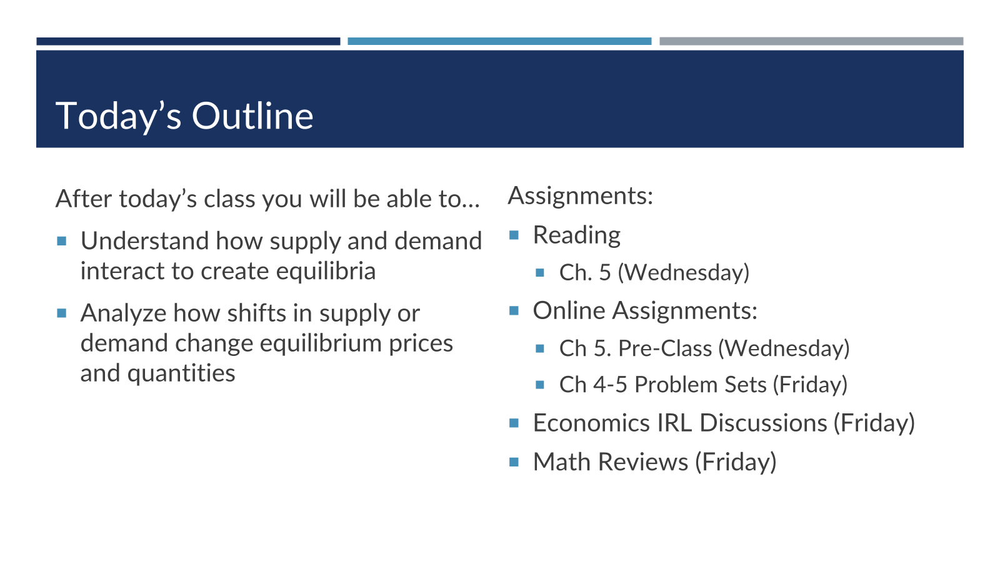

class:middle

# Supply and Demand

<!--
TODO:
- screenshots of news stories
- with narratives and then solutions 
- embeded econ graph of supply/demand

> For your visit, you will be guest lecturing a 75-minute principles of Microeconomics course (150 students). The class will be on demand and supply equilibrium, and I have attached to this email, a scanned copy of the chapter from the text used in the class (Stevenson and Wolfers). Please use this in preparing for the guest lecture. The class as taught, uses the flipped classroom format and so students may be coming into the class with some background knowledge. As such, you may wish to focus more on problem solving. I have also copied the instructor of the class: Mike Ricks, feel free to reach out to him if you have any questions or concerns.

Learning Goals:
- Understand how supply and demand interact to create equilibria
- analyze how shifts in supply or demand change prices and quantities

to send? Just another quick double check: supply and demand curves, along with shortages and surpluses were introduced in a previous chapter/lecture, correct? This lecture 

ECONGRAPHS THAT ARE DIRECTLY RELEVANT
https://www.econgraphs.org/graphs/competition/equilibrium/shortage_surplus
https://www.econgraphs.org/graphs/competition/equilibrium/comp_direct_effect
https://www.econgraphs.org/graphs/competition/equilibrium/comp_eq_effect
Might want to make one where I can shift the curves?

-------
introduce concept of demand
ask for an example that students would be willing to pay, draw example on board
project prepared example, blank graph, give students chance to solve, 

Same for Supply,
Put them together
---------
Actually, it looks like that basic material was covered in prior chapters

REVIEW
Setup supply and demand example.
Use to review shortage and surplus
EQUILIBRIUM
introduce concept of equilibrium
   equal libra - qs and qd in balance
   but also its when there isn't a trade to be made
shortages cause prices to rise
surplus causes prices to fall
SHOCKS
increase in demand leads to higher P and Q
increase in supply leads to higher Q but lower P
Do several more narrative examples.

- list of things that change supply or demand

EXAMPLES
toilet paper
lines for gas
parking meters outside my house
parking outside the minneapolis state fair
electricity markets
oranges

-->

---

---

<link href="https://kineticgraphs.org/css/kg.0.2.6.css" rel="stylesheet" type="text/css">

---

---

