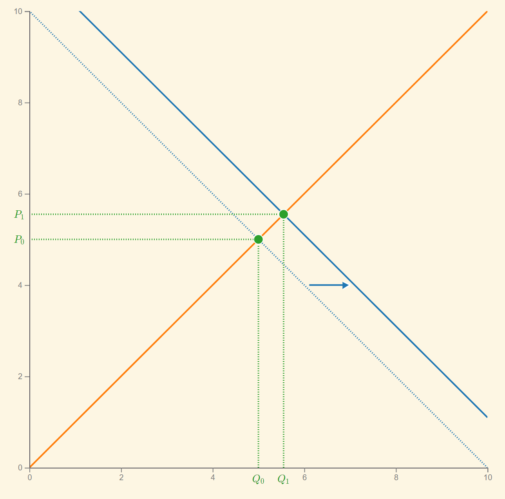
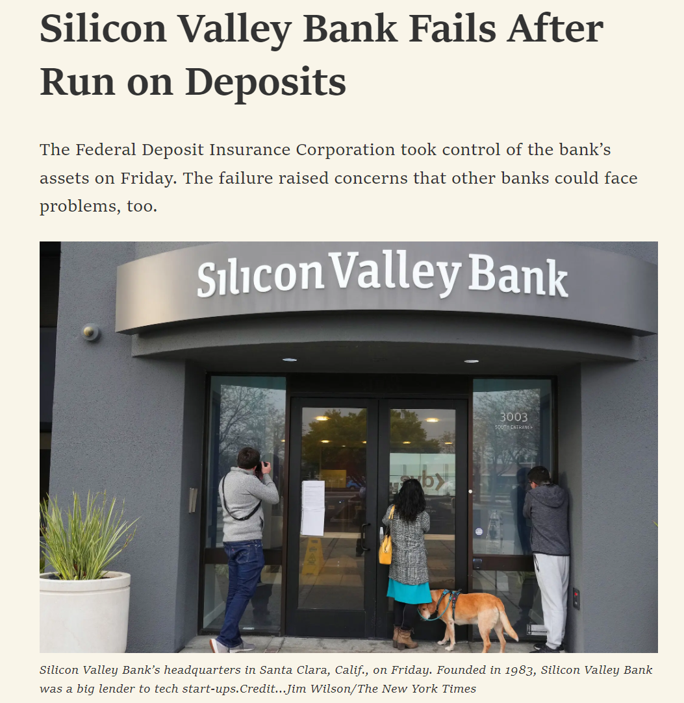

class:middle

# Teaching Philosophy

<!--
As for the teaching philosophy seminar, this will be a 20-minute talk about your approach in the classroom covering preparation, lecture style, student engagement, assessment, technology, etc. It should give faculty an idea of your approach to teaching in general. Be sure to contrast what you would do in a regular class with what you would do in the guest lecture since you will be somewhat limited. The remaining 10 minutes will be allocated for questions should the faculty have any.

Lecture Tech (boardwork gag, lyx)
Planning and outlines of class (hw thing I told terry, key objectives)
Clear goals for students.
Repetition and Signposting
Assessment: test design and homework feedback
-->

---

class:middle

## I Prefer Boardwork Over Slides

<!--
TODO:
BIG LONG SLIDE ABOUT WHY SLIDES ARE FRAUGHT
-->

---

## I Prefer Boardwork Over Slides

- It's far too easy to pack too much information into slide decks. This can cause the following problems in the classroom:
    - Students can be overwhelmed by too much information appearing at once. 
    - It's far too easy to speed through the material. 
    - Students may feel compelled to write *everything* on the slides into their notes. 
    - And finally, conflicting stimulus can be distracting.
        - The best case scenario is that you read everything on the slide verbatim,
        - But if what you are saying is different than what is on the slides, this mismatch between visual and auditory stimuli impairs comprehension of both.
        - This bullet point is really just a distraction. I don't even mention it in my talk.
- So I prefer working on the board.

---

---

## Projected Material Should Complement the Lecture

---

